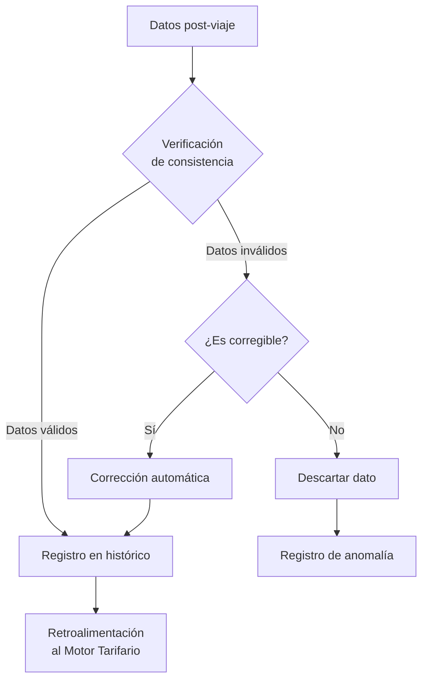
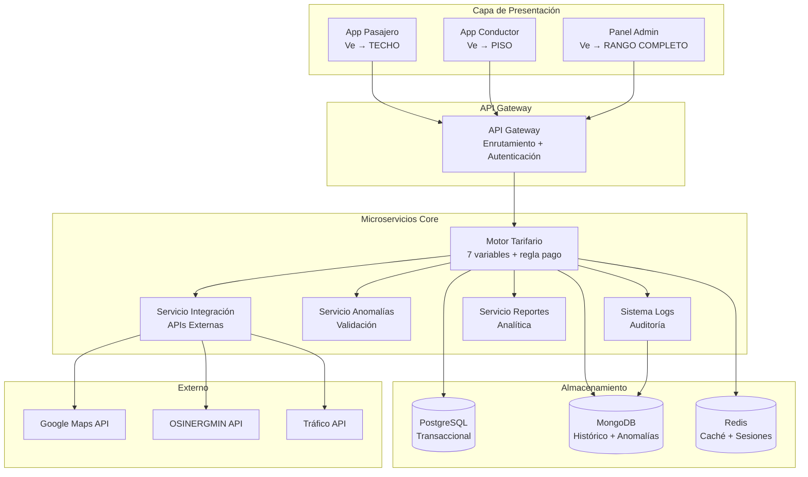
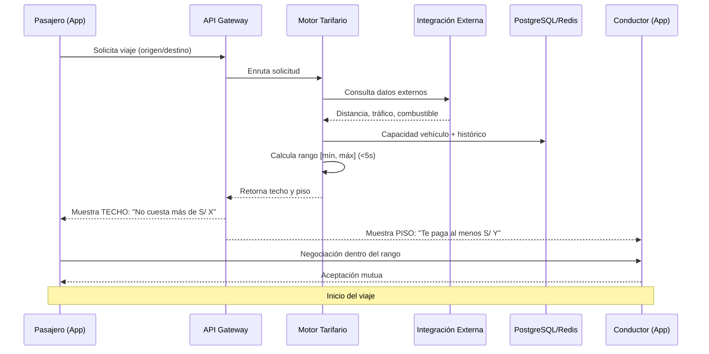
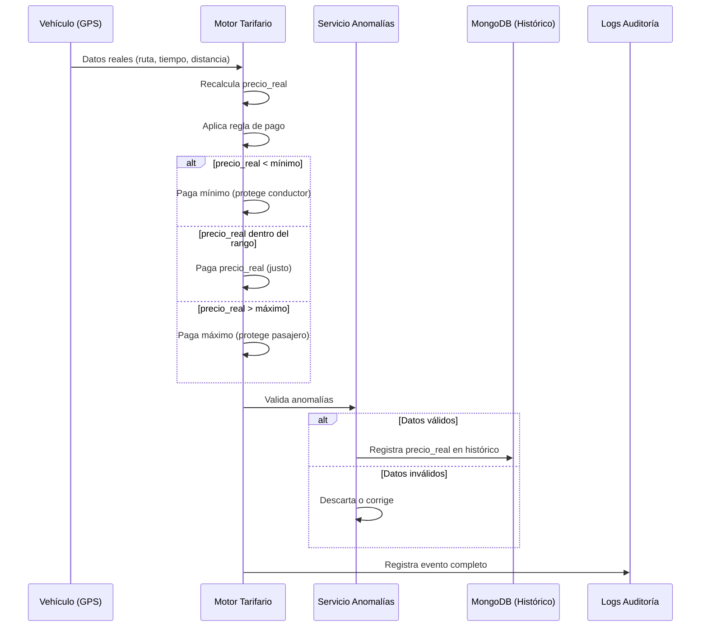
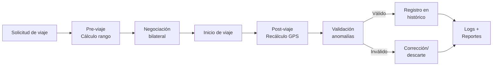
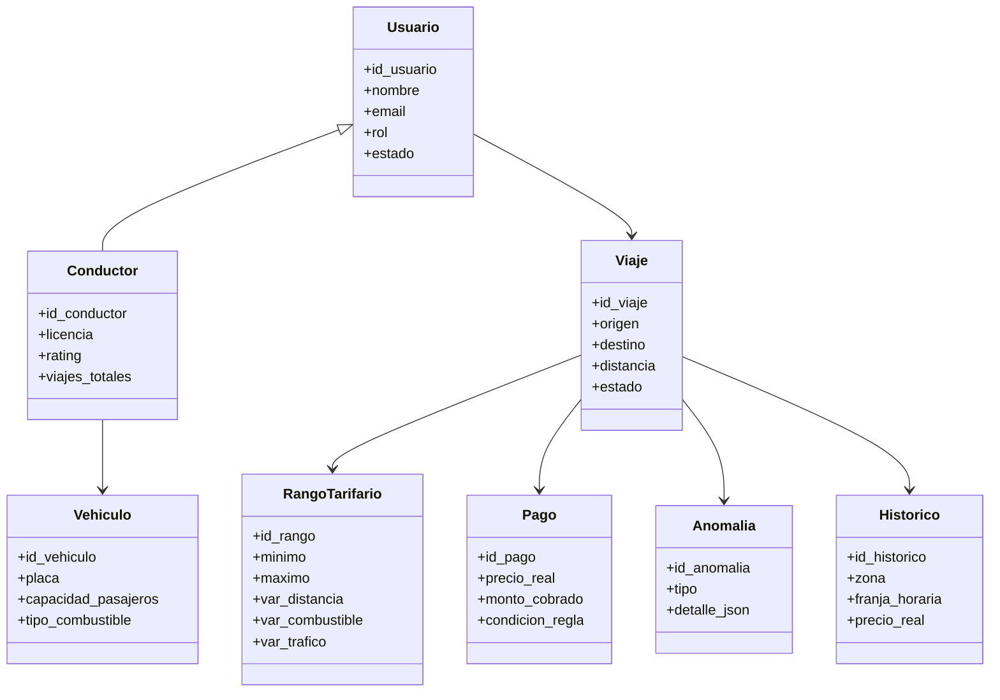
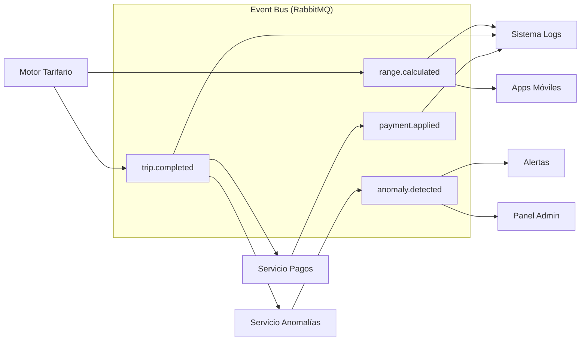

## Arquitectura General del Sistema

<div align="center">

*MVP Lima Metropolitana | Duración: 8 meses*

</div>

---
## Índice

1. [Tipo de Solución](#1-tipo-de-solución)
2. [Arquitectura General](#2-arquitectura-general)
3. [Capas de la Arquitectura](#3-capas-de-la-arquitectura)
4. [Componentes del Sistema](#4-componentes-del-sistema)
5. [Las 7 Variables del Motor](#5-las-7-variables-del-motor)
6. [Flujos del Sistema](#6-flujos-del-sistema)
7. [Diagramas Arquitectónicos](#7-diagramas-arquitectónicos)
8. [Comunicación entre Componentes](#8-comunicación-entre-componentes)
9. [Manejo de Errores y Degradación Elegante (CAR-010)](#9-manejo-de-errores-y-degradación-elegante-car-010)
10. [Entidades Principales](#10-entidades-principales)

### 1. Tipo de Solución

El sistema consiste en un **Motor Tarifario Inteligente** para **inDrive** (MVP Lima Metropolitana) que calcula un rango de precio `[mínimo, máximo]` antes del viaje y determina el precio real a pagar al finalizar, aplicando una regla de protección bilateral.

### Características clave

| Característica | Descripción |
|----------------|-------------|
| **Cálculo pre-viaje** | Pondera 7 variables en menos de 5 segundos |
| **Visualización asimétrica** | Pasajero ve solo el **techo** / Conductor ve solo el **piso** |
| **Negociación acotada** | Libre pero dentro del rango `[mínimo, máximo]` |
| **Regla de pago invariante** | `pago = max(mínimo, min(precio_real, máximo))` |
| **Filtro de anomalías** | Protege el histórico de datos corruptos |
| **Trazabilidad total** | Registro completo de ambas fases |
---

### 2. Arquitectura General

El sistema se basa en una **arquitectura de microservicios** con comunicación síncrona (REST) y asíncrona (eventos), desplegada en contenedores Docker orquestados localmente (MVP) con proyección a Kubernetes de forma local.

#### Flujo General

|                             |
|-----------------|
||

---

### Estilo arquitectónico

| Estilo | Rol dentro del sistema |
|--------|----------------------|
| **Microservicios** | Estilo principal para modularización y escalabilidad |
| **Arquitectura orientada a eventos (EDA)** | Comunicación y procesamiento en tiempo real |
| **Arquitectura por capas** | Separación de presentación, negocio y datos |

---

## 3. Capas de la Arquitectura

<table>
<tr>
<th>Capa</th>
<th>Responsabilidad</th>
</tr>
<tr>
<td><b>Capa de Entrada</b></td>
<td>APIs externas (Google Maps, OSINERGMIN, Tráfico) + GPS</td>
</tr>
<tr>
<td><b>Capa de Cálculo</b></td>
<td>Microservicio que pondera 7 variables y aplica reglas</td>
</tr>
<tr>
<td><b>Capa de Visualización Asimétrica</b></td>
<td>Techo para pasajero / Piso para conductor</td>
</tr>
<tr>
<td><b>Capa Post-viaje</b></td>
<td>Recálculo con GPS + regla de pago</td>
</tr>
<tr>
<td><b>Panel Administrativo</b></td>
<td>Parametrización, seguimiento y reportes</td>
</tr>
</table>

---

## 4. Componentes del Sistema

```mermaid
flowchart TD
    subgraph "Capa de Presentación"
        AppPasajero["App Pasajero<br/>React Native"]
        AppConductor["App Conductor<br/>React Native"]
        PanelAdmin["Panel Admin<br/>React"]
    end

    subgraph "API Gateway"
        Gateway["API Gateway<br/>Node.js + NestJS"]
    end

    subgraph "Microservicios Core"
        Motor["Motor Tarifario<br/>Node.js + NestJS"]
        Integracion["Servicio Integración<br/>APIs Externas"]
        Anomalias["Servicio Anomalías<br/>Validación"]
        Logs["Sistema Logs<br/>Auditoría"]
    end

    subgraph "Almacenamiento"
        PostgreSQL[("PostgreSQL<br/>Transaccional")]
        MongoDB[("MongoDB<br/>Histórico + Auditoría")]
        Redis[("Redis<br/>Caché + Sesiones")]
    end

    subgraph "Externo"
        GoogleMaps["Google Maps API"]
        OSINERGMIN["OSINERGMIN API"]
        TrafficAPI["Tráfico API"]
    end

    AppPasajero --> Gateway
    AppConductor --> Gateway
    PanelAdmin --> Gateway
    Gateway --> Motor
    Motor --> Integracion
    Motor --> Anomalias
    Motor --> Logs
    Integracion --> GoogleMaps
    Integracion --> OSINERGMIN
    Integracion --> TrafficAPI
    Motor --> PostgreSQL
    Motor --> MongoDB
    Motor --> Redis
````

### Descripción de componentes

| Componente | Función |
|------------|---------|
| **Aplicación Móvil** | Interfaz para pasajeros y conductores |
| **API Gateway** | Punto único de entrada, autenticación y enrutamiento |
| **Motor Tarifario** | Núcleo: pondera 7 variables y genera `[mínimo, máximo]` |
| **Servicio de Integración** | Gestiona APIs externas (Google, OSINERGMIN, tráfico) |
| **Servicio de Anomalías** | Detecta inconsistencias y protege el histórico |
| **Servicio de Reportes** | Genera métricas de demanda y precios |
| **Panel Administrativo** | Configura reglas y visualiza rango completo |
| **Sistema de Logs** | Registro inmutable para trazabilidad |

---

## 5. Las 7 Variables del Motor

<table>
<tr>
<th>Tipo</th>
<th>Variable</th>
<th>Fuente</th>
</tr>
<tr>
<td rowspan="3"><b>Base</b></td>
<td>Distancia del trayecto</td>
<td>API Google Maps / GPS</td>
</tr>
<tr>
<td>Precio del combustible</td>
<td>API OSINERGMIN</td>
</tr>
<tr>
<td>Capacidad del vehículo</td>
<td>Perfil del conductor</td>
</tr>
<tr>
<td rowspan="3"><b>Dinámica</b></td>
<td>Condición del tráfico</td>
<td>API de tráfico en tiempo real</td>
</tr>
<tr>
<td>Hora del día / demanda zonal</td>
<td>Reloj + datos históricos zonales</td>
</tr>
<tr>
<td>Tiempo estimado del viaje</td>
<td>API de tráfico</td>
</tr>
<tr>
<td><b>Aprendizaje</b></td>
<td>Histórico de viajes similares</td>
<td>Base datos interna inDrive</td>
</tr>
</table>

```mermaid
flowchart TD
    subgraph Entradas
        V1[Distancia<br/>Google Maps]
        V2[Combustible<br/>OSINERGMIN]
        V3[Capacidad<br/>Vehículo]
        V4[Tráfico<br/>API Tiempo Real]
        V5[Hora/Demanda<br/>Reloj + Zona]
        V6[Tiempo estimado<br/>API Tráfico]
        V7[Histórico<br/>Base inDrive]
    end

    subgraph Procesamiento
        Motor[Motor Tarifario<br/>Ponderación de 7 variables]
    end

    subgraph Salida
        Rango[Rango mínimo, máximo]
    end

    V1 --> Motor
    V2 --> Motor
    V3 --> Motor
    V4 --> Motor
    V5 --> Motor
    V6 --> Motor
    V7 --> Motor
    Motor --> Rango
```

---

## 6. Flujos del Sistema

### Flujo Pre-viaje

<table>
<tr>
<td width="70%">

```text
┌─────────────────────────────────────────────────────────────┐
│ 1. Pasajero solicita viaje (origen/destino)                 │
└─────────────────────────────┬───────────────────────────────┘
                              ↓
┌─────────────────────────────────────────────────────────────┐
│ 2. Motor recopila 7 variables en tiempo real                │
│    • Distancia • Combustible • Capacidad                    │
│    • Tráfico • Hora/Demanda • Tiempo estimado • Histórico   │
└─────────────────────────────┬───────────────────────────────┘
                              ↓
┌─────────────────────────────────────────────────────────────┐
│ 3. Genera rango [mínimo, máximo] (<5 segundos)              │
└─────────────────────────────┬───────────────────────────────┘
                              ↓
┌─────────────────────────────────────────────────────────────┐
│ 4. Visualización asimétrica                                 │
│    ┌─────────────────┐    ┌─────────────────┐               │
│    │ Pasajero → TECHO │    │ Conductor → PISO │             │
│    │ "No cuesta más  │    │ "Te paga al     │               │
│    │  de S/ X"       │    │  menos S/ Y"    │               │
│    └─────────────────┘    └─────────────────┘               │
└─────────────────────────────┬───────────────────────────────┘
                              ↓
┌─────────────────────────────────────────────────────────────┐
│ 5. Negociación bilateral acotada dentro del rango           │
└─────────────────────────────┬───────────────────────────────┘
                              ↓
┌─────────────────────────────────────────────────────────────┐
│ 6. Ambas partes aceptan → Inicio del viaje                  │
└─────────────────────────────────────────────────────────────┘
```

</td>
</tr>
</table>

### Flujo Post-viaje

```text
┌─────────────────────────────────────────────────────────────┐
│ 1. Finalización del viaje                                   │
└─────────────────────────────┬───────────────────────────────┘
                              ↓
┌─────────────────────────────────────────────────────────────┐
│ 2. Captura de datos GPS reales                              │
│    • Ruta real recorrida                                    │
│    • Tiempo real de viaje                                   │
│    • Distancia real                                         │
│    • Paradas / desvíos                                      │
└─────────────────────────────┬───────────────────────────────┘
                              ↓
┌─────────────────────────────────────────────────────────────┐
│ 3. Recalcula precio_real                                    │
└─────────────────────────────┬───────────────────────────────┘
                              ↓
┌─────────────────────────────────────────────────────────────┐
│ 4. Aplica regla de pago                                     │
│                                                             │
│    pago = max(mínimo, min(precio_real, máximo))             │
│                                                             │
│    ┌─────────────────────────────────────────────────────┐  │
│    │ Si precio_real < mínimo  → paga mínimo              │  │
│    │ Si precio_real en rango   → paga precio_real        │  │
│    │ Si precio_real > máximo   → paga máximo             │  │
│    └─────────────────────────────────────────────────────┘  │
└─────────────────────────────┬───────────────────────────────┘
                              ↓
┌─────────────────────────────────────────────────────────────┐
│ 5. Filtro de anomalías                                      │
└─────────────────────────────┬───────────────────────────────┘
                              ↓
┌─────────────────────────────────────────────────────────────┐
│ 6. Registro en histórico + Logs de auditoría                │
└─────────────────────────────────────────────────────────────┘
```

### Flujo de Validación de Anomalías



---

## 7. Diagramas Arquitectónicos

### Diagrama de Componentes



### Diagrama de Secuencia (Solicitud de viaje)



### Diagrama de Secuencia (Post-viaje y regla de pago)



### Diagrama de Procesos General



### Diagrama de Clases (Entidades principales)



---

## 8. Comunicación entre Componentes

### Comunicaciones Síncronas (REST/HTTPS)

| Origen | Destino | Propósito | Timeout |
|--------|---------|-----------|---------|
| App Móvil | API Gateway | Autenticación y solicitudes | 5s |
| API Gateway | Motor Tarifario | Cálculo de rango | 5s |
| Motor Tarifario | Servicio Integración | Consulta APIs externas | 3s |
| Motor Tarifario | PostgreSQL/Redis | Lectura de datos | 2s |

### Comunicaciones Asíncronas (Eventos)

| Evento | Productor | Consumidor |
|--------|-----------|------------|
| `range.calculated` | Motor Tarifario | Logs, Apps móviles |
| `trip.completed` | Motor Tarifario | Anomalías, Pagos, Logs |
| `anomaly.detected` | Servicio Anomalías | Alertas, Logs, Panel Admin |
| `payment.applied` | Servicio Pagos | Logs, Apps |



---

## 9. Manejo de Errores y Degradación Elegante (CAR-010)

### Estrategias de fallback por servicio

| Servicio | Fallback | Tiempo de degradación |
|----------|----------|----------------------|
| **Google Maps** | Distancia estimada por coordenadas directas | <1 segundo |
| **OSINERGMIN** | Último precio conocido válido | 24 horas |
| **Tráfico API** | Multiplicador base (1.3x) según hora del día | Tiempo real |
| **Sistemas internos** | Datos cacheados del usuario | <500 ms |

### Mecanismos de tolerancia a fallos

```text
┌─────────────────────────────────────────────────────────────┐
│                    TOLERANCIA A FALLOS                      │
├─────────────────────────────────────────────────────────────┤
│                                                             │
│   ┌─────────────┐    ┌─────────────┐    ┌─────────────┐     │
│   │  Timeout    │ →  │   Circuit   │ →  │    Retry    │     │
│   │ configurable│    │   Breaker   │    │  backoff    │     │
│   │   (3-5s)    │    │ (3 fallos)  │    │ exponencial │     │
│   └─────────────┘    └─────────────┘    └─────────────┘     │
│                                                             │
│   ┌─────────────┐    ┌─────────────┐                        │
│   │   Health    │ →  │  Fallback   │                        │
│   │   Checks    │    │   cache     │                        │
│   └─────────────┘    └─────────────┘                        │
│                                                             │
└─────────────────────────────────────────────────────────────┘
```

---

## 10. Entidades Principales

| # | Entidad | Descripción | Almacén |
|---|---------|-------------|---------|
| 1 | **Usuario** | Persona registrada (pasajero, conductor, admin, auditor) | PostgreSQL |
| 2 | **Conductor** | Perfil operativo del conductor | PostgreSQL |
| 3 | **Vehículo** | Vehículo afiliado (capacidad, consumo) | PostgreSQL |
| 4 | **Viaje** | Servicio de transporte solicitado | PostgreSQL |
| 5 | **Negociación** | Sesión de regateo acotada al rango | PostgreSQL |
| 6 | **Oferta** | Cada contraoferta durante la negociación | PostgreSQL |
| 7 | **RangoTarifario** | `[mínimo, máximo]` calculado pre-viaje | PostgreSQL |
| 8 | **Tarifa** | Precio aplicado al viaje (estimado/final) | PostgreSQL |
| 9 | **Pago** | Aplica la regla invariante CAR-004 | PostgreSQL |
| 10 | **Parámetro** | Configuración de pesos y multiplicadores | PostgreSQL |
| 11 | **Anomalía** | Viaje rechazado por filtro CAR-005 | MongoDB |
| 12 | **Histórico** | Viaje validado para aprendizaje | MongoDB |
| 13 | **LogAuditoria** | Evento del sistema para trazabilidad | OpenSearch |

---

## Resumen de Atributos de Calidad

| Atributo | Métrica | SLO |
|----------|---------|-----|
| Rendimiento | Tiempo cálculo pre-viaje | <5 segundos |
| Precisión | Precisión del cálculo tarifario | ≥90% |
| Disponibilidad | Disponibilidad del sistema | ≥99.5% |
| Escalabilidad | Solicitudes concurrentes | >10,000 |

---

<div align="center">

---

**Documento de Arquitectura de Software — inDrive** | *Mayo 2026*

</div>
