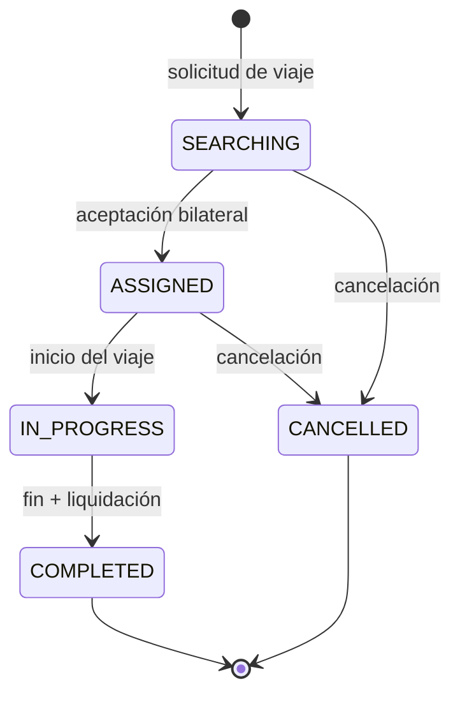

# Decisiones de Arquitectura y Patrones de Diseño (explicación en claro)

> Este documento resume, **en lenguaje simple y orientado a la audiencia**, las decisiones
> de arquitectura y los patrones de diseño del **Motor Tarifario Inteligente — inDrive+**.
> El detalle técnico formal está en los [ADRs](decisiones_arquitectonicas.md); aquí está el
> *qué*, el *por qué* y una analogía para cada uno.

---

## 1. El problema (en una frase)

El pasajero teme **pagar de más** y el conductor teme **ganar de menos**. Nuestra solución
calcula un **rango de precio justo** `[mínimo, máximo]` y lo muestra de forma **asimétrica**:
el pasajero solo ve el **techo** ("no pagarás más de S/ X") y el conductor solo el **piso**
("te pagarán al menos S/ Y"). Al terminar el viaje se aplica una regla que protege a ambos.

---

## 2. Decisiones de arquitectura clave

| Decisión | En simple (analogía) | Por qué la tomamos | ADR |
| --- | --- | --- | --- |
| **Microservicios** (api-gateway, ms-base, ms-pricing, ms-integration, ms-reports) | Piezas de Lego independientes: si una se cae, las demás siguen funcionando | Permite trabajar en paralelo y aislar fallos; cada servicio tiene una responsabilidad | [ADR-001](decisiones_arquitectonicas.md) |
| **Visualización asimétrica** techo/piso | Un regateo con límites invisibles: cada parte solo ve su lado | Es el diferencial del producto; protege el margen sin revelar el rango | [ADR-002](decisiones_arquitectonicas.md) |
| **Regla de pago invariante** `pago = max(mín, min(real, máx))` | Un termostato: nunca baja del mínimo ni sube del máximo | Garantiza un pago justo y acotado aunque el viaje real se desvíe | [ADR-003](decisiones_arquitectonicas.md) |
| **Persistencia poliglota** (PostgreSQL + MongoDB + Redis) | Cada cosa en el cajón correcto | SQL para lo transaccional, Mongo para auditoría, Redis para cache/eventos | [ADR-004](decisiones_arquitectonicas.md) |
| **Bus de eventos (Redis Pub/Sub)** | Un altavoz: quien le interese, escucha; el que habla no espera respuesta | Desacopla el motor de la auditoría/reportes; no se bloquean entre sí | [ADR-005](decisiones_arquitectonicas.md) |
| **Degradación elegante** (circuit breaker) | El interruptor de la casa: corta antes de que se queme todo | Si una API externa (mapas/tráfico) falla, la app no se cae: usa un valor de respaldo | [ADR-006](decisiones_arquitectonicas.md) |
| **Seguridad por roles (JWT + RBAC)** | Llaves distintas según quién eres (pasajero, conductor, admin, auditor) | Cada rol ve y hace solo lo suyo; el auditor lee pero no modifica | [ADR-008](decisiones_arquitectonicas.md) |

> **Nota MVP:** el diseño original contemplaba 7 microservicios, RabbitMQ y OpenSearch. El MVP
> entregado usa **5 servicios**, **Redis** como bus y **MongoDB** para auditoría. Estas
> desviaciones son conscientes y están justificadas en la
> [Gestión de Cambio](../Presentacion_Final/gestion_de_cambio.md).

---

## 3. Patrones de diseño utilizados

| Patrón | Qué es (en simple) | Dónde / para qué en el proyecto |
| --- | --- | --- |
| **Capas: Controller → Service → Repository** | Cada capa una tarea: recibir la petición, aplicar la regla de negocio, hablar con la base | Estructura obligatoria del backend NestJS; mantiene el código ordenado y testeable |
| **DTO / Presenter por rol** | Un "filtro de salida" que arma la respuesta según quién pregunta | **Así se logra la asimetría**: el presentador muestra el techo al pasajero y el piso al conductor — nunca se filtra en la base de datos |
| **Máquina de estados** | Un semáforo con transiciones válidas | Los viajes solo pueden pasar `SEARCHING → ASSIGNED → IN_PROGRESS → COMPLETED/CANCELLED`; se rechazan saltos inválidos |
| **API Gateway** | Una recepción única que dirige a cada oficina | Punto de entrada del panel web: enruta a cada microservicio y centraliza CORS y límites |
| **Circuit Breaker** | El interruptor que corta ante fallos repetidos | En las llamadas a servicios externos (mapas/tráfico/combustible): abre el circuito y responde con respaldo |
| **Pub/Sub (Event-Driven)** | Publicar en un altavoz; los interesados reaccionan | El motor publica `pricing.calculated` / `pricing.settled` / `anomaly.detected`; auditoría y reportes los consumen |

### Diagrama de la máquina de estados del viaje

---

## 4. Para exponer (cómo bajar el nivel técnico)

Al presentar, usar el **beneficio** en lugar de la jerga:

| En vez de decir… | Decir… |
| --- | --- |
| "Circuit Breaker" | "si un servicio externo falla, la app **no se cae**" |
| "Pub/Sub / Event-Driven" | "los reportes y la auditoría **no frenan** la operación" |
| "Persistencia poliglota" | "cada dato en **la base más adecuada**" |
| "Visualización asimétrica por DTO" | "cada usuario ve **solo su lado** del precio" |
| "Regla de pago invariante" | "nadie paga de más **ni** cobra de menos" |

Dejar los detalles (puertos, patrones GoF, esquemas) como **respaldo para preguntas**, no como hilo principal.
