# Flujo de Cálculo de Tarifa

## Motor Tarifario Inteligente — inDrive

<div align="center">

*MVP Lima Metropolitana | Duración: 8 meses | Presupuesto: USD $182,000*

</div>

---

## Índice

1. [Visión General del Negocio](#visión-general-del-negocio)
2. [Las 7 Variables del Modelo Tarifario](#las-7-variables-del-modelo-tarifario)
3. [Fase Pre-viaje: Cálculo del Rango](#fase-pre-viaje-cálculo-del-rango)
4. [Visualización Asimétrica: Techo y Piso](#visualización-asimétrica-techo-y-piso)
5. [Negociación Acotada](#negociación-acotada)
6. [Fase Post-viaje: Regla de Pago Invariante](#fase-post-viaje-regla-de-pago-invariante)
7. [Filtro de Anomalías](#filtro-de-anomalías)
8. [Ejemplos Prácticos](#ejemplos-prácticos)
9. [Resumen del Flujo de Negocio](#resumen-del-flujo-de-negocio)
10. [Reglas de Negocio No Negociables](#reglas-de-negocio-no-negociables)

---

## Visión General del Negocio

El **Motor Tarifario Inteligente** es el corazón económico de inDrive en Lima Metropolitana. Su objetivo es **equilibrar dos fuerzas aparentemente opuestas**:

| Fuerza | Necesidad del negocio |
| :--- | :--- |
| **Libertad de negociación** | Valor central de inDrive. Los usuarios quieren regatear. |
| **Protección bilateral** | Evitar que el pasajero pague de más o el conductor cobre de menos. |

**La solución del negocio:**  
No eliminar la negociación, sino **acotarla dentro de límites objetivos** basados en datos reales (distancia, tráfico, combustible, etc.).

### ¿Qué valor genera para el negocio?

| Stakeholder | Valor recibido |
| :--- | :--- |
| **Pasajero** | Garantía de no pagar más de X (techo). Confianza en el precio. |
| **Conductor** | Garantía de no cobrar menos de Y (piso). Ingreso base asegurado. |
| **inDrive** | Diferenciación competitiva, menor fricción en negociaciones, menos reclamos. |

---

## Las 7 Variables del Modelo Tarifario

El motor pondera **7 variables** para calcular el rango `[mínimo, máximo]`. Cada variable tiene un peso configurable desde el panel administrativo.

| Tipo | # | Variable | Fuente | Impacto en el negocio |
| :--- | :--- | :--- | :--- | :--- |
| **Base** | 1 | Distancia del trayecto | Google Maps API | A mayor distancia, mayor costo base. |
| **Base** | 2 | Precio del combustible | OSINERGMIN (dataset local) | Cuando el combustible sube, el mínimo se eleva. |
| **Base** | 3 | Capacidad del vehículo | Perfil del conductor | Vehículos más grandes tienen mayor costo operativo. |
| **Dinámica** | 4 | Condición del tráfico | Tráfico (simulado) | Tráfico pesado → más tiempo → mayor precio (hasta ×2.0). |
| **Dinámica** | 5 | Hora del día / demanda zonal | Reloj + histórico | Horas punta y zonas calientes elevan precios. |
| **Dinámica** | 6 | Tiempo estimado del viaje | Google Maps (duración) | Viajes más largos en tiempo → mayor precio. |
| **Aprendizaje** | 7 | Histórico de viajes similares | Base inDrive | El sistema aprende de viajes pasados para mejorar la precisión. |

### Diagrama de flujo de las 7 variables

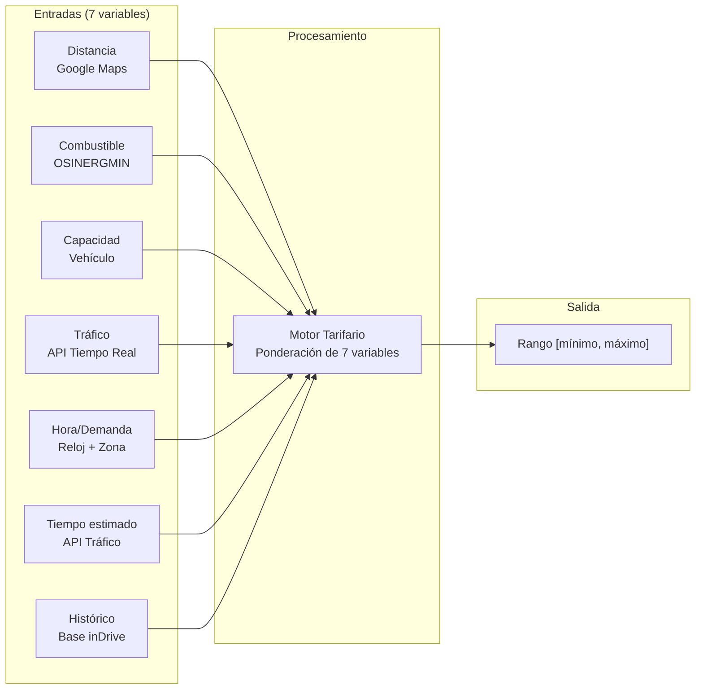

---

## Fase Pre-viaje: Cálculo del Rango

### ¿Qué pasa detrás del negocio?

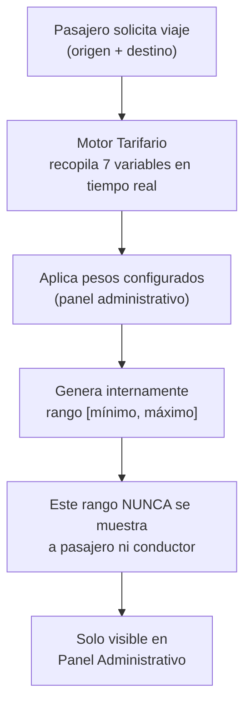

### ¿Qué garantiza este rango?

| Concepto | Garantía para el negocio |
| :--- | :--- |
| **Mínimo (Piso)** | El conductor nunca recibirá menos de este valor. |
| **Máximo (Techo)** | El pasajero nunca pagará más de este valor. |

**Ejemplo concreto:**
> El motor calcula el rango `[S/ 12.00, S/ 25.00]`
> - El conductor sabe que ganará **al menos S/ 12.00**
> - El pasajero sabe que pagará **como máximo S/ 25.00**

---

## Visualización Asimétrica: Techo y Piso

### ¿Por qué el negocio eligió esta estrategia?

Si ambos actores vieran el rango completo `[S/ 12.00, S/ 25.00]`:

| Actor | Reacción | Problema |
| :--- | :--- | :--- |
| **Pasajero** | Ofertará siempre **S/ 12.00** (el mínimo) | Quiere pagar lo menos posible |
| **Conductor** | Exigirá siempre **S/ 25.00** (el máximo) | Quiere cobrar lo más posible |

**Efecto de anclaje:** la negociación se polariza y se vuelve ineficiente.

### La solución asimétrica:

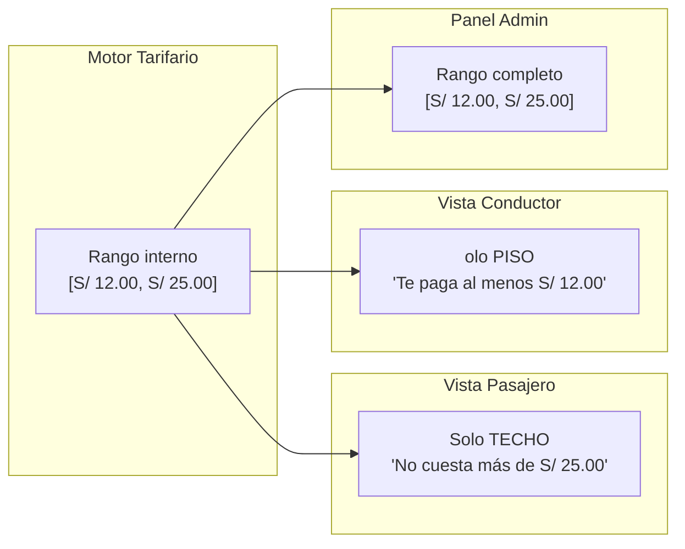

### Mensajes exactos al usuario:

| Actor | Mensaje que ve |
| :--- | :--- |
| **Pasajero** | *"Este viaje no te costará más de S/ 25.00"* |
| **Conductor** | *"Este viaje te pagará al menos S/ 12.00"* |
| **Administrador** | *"Rango: [S/ 12.00, S/ 25.00]"* |

### Beneficio para el negocio:

| Beneficio | Descripción |
| :--- | :--- |
| ✅ **Confianza** | Ambas partes tienen una garantía clara. |
| ✅ **Negociación eficiente** | Ninguna parte tiene un punto de referencia extremo. |
| ✅ **Diferenciación** | inDrive mantiene su esencia de regateo, pero con reglas justas. |

---

## Negociación Acotada

### ¿Cómo funciona la negociación?

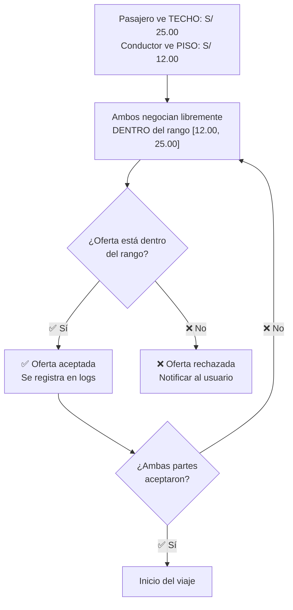

### Reglas de negocio:

| Regla | Descripción |
| :--- | :--- |
| **Oferta válida** | Debe estar entre `mínimo` y `máximo` (inclusive). |
| **Múltiples contraofertas** | Ambas partes pueden ofertar varias veces. |
| **Sin revelar extremos** | El sistema nunca muestra los límites durante la negociación. |
| **Registro total** | Cada oferta se registra para trazabilidad (CAR-007). |

### Ejemplo de negociación:

| Paso | Pasajero | Conductor | Sistema |
| :--- | :--- | :--- | :--- |
| 1 | Ofrece S/ 14.00 | - | ✅ Aceptada (dentro del rango) |
| 2 | - | Contraeofrece S/ 22.00 | ✅ Aceptada |
| 3 | Ofrece S/ 18.00 | - | ✅ Aceptada |
| 4 | - | Acepta S/ 18.00 | ✅ Acuerdo bilateral |

---

## Fase Post-viaje: Regla de Pago Invariante

### ¿Qué pasa después del viaje?

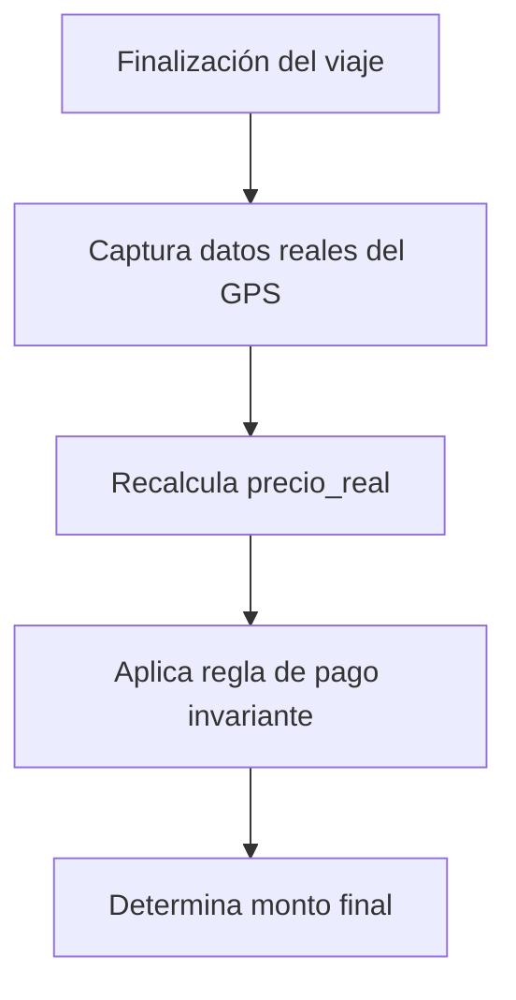

### La regla de pago (invariante de negocio):

<div align="center">

**`pago = max(mínimo, min(precio_real, máximo))`**

</div>

### ¿Qué significa esta fórmula para el negocio?

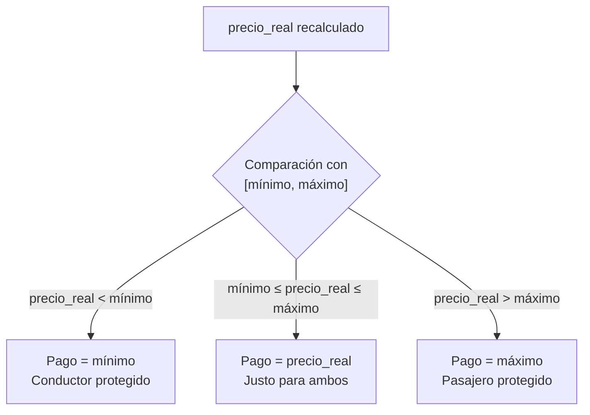

### Tabla resumen de escenarios:

| Escenario | Condición | Pago final | Protección |
| :--- | :--- | :--- | :--- |
| Viaje más rápido | `precio_real < mínimo` | `mínimo` | Conductor cobra más de lo real |
| Viaje exacto | `precio_real` dentro del rango | `precio_real` | Justo para ambos |
| Viaje más lento (tráfico/desvío) | `precio_real > máximo` | `máximo` | Pasajero paga menos de lo real |

### Ejemplos concretos:

| Caso | Rango | Precio real | Pago final | ¿Qué pasó? |
| :--- | :--- | :--- | :--- | :--- |
| **Caso 1** | `[S/ 12, S/ 25]` | S/ 10 | **S/ 12** | Viaje más rápido → Conductor protegido |
| **Caso 2** | `[S/ 12, S/ 25]` | S/ 18 | **S/ 18** | Viaje exacto → Justo para ambos |
| **Caso 3** | `[S/ 12, S/ 25]` | S/ 30 | **S/ 25** | Viaje con tráfico → Pasajero protegido |

---

## Filtro de Anomalías

### ¿Por qué el negocio necesita un filtro?

El histórico de viajes se usa para **aprender** y mejorar los cálculos futuros. Si entran datos corruptos (GPS erróneo, rutas inválidas), el sistema aprende mal.

### ¿Cómo funciona?

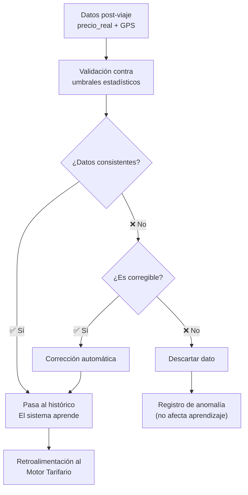

### Reglas de negocio:

| Regla | Descripción |
| :--- | :--- |
| **Calidad ante todo** | Solo datos confiables entran al histórico. |
| **Trazabilidad** | Todas las anomalías se registran para auditoría. |
| **Configurabilidad** | Los umbrales se ajustan desde panel admin (CAR-006). |

---

## Ejemplos Prácticos

### Ejemplo 1: Viaje estándar en hora punta

| Variable | Valor |
| :--- | :--- |
| Distancia | 8 km |
| Combustible | S/ 5.50/galón |
| Tráfico | Alto (multiplicador 1.8x) |
| Hora | 7:00 PM (demanda alta) |
| Capacidad | 4 pasajeros |

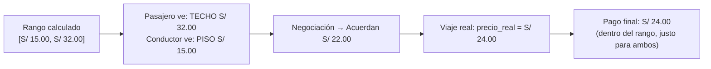

---

### Ejemplo 2: Viaje corto con mucho desvío

| Variable | Valor |
| :--- | :--- |
| Distancia estimada | 3 km |
| Tráfico | Bajo |
| Hora | 2:00 PM (demanda normal) |

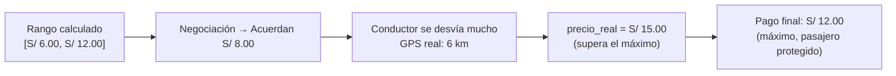

---

### Ejemplo 3: Viaje más rápido de lo estimado

| Variable | Valor |
| :--- | :--- |
| Distancia | 10 km |
| Tráfico estimado | Alto |
| Tráfico real | Bajo |

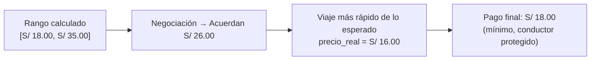

---

## Resumen del Flujo de Negocio

### Diagrama general del flujo completo

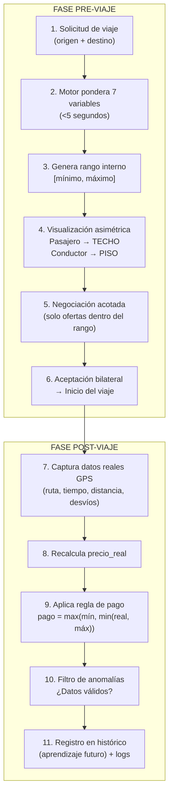

### Flujo de negocio en texto (vista ejecutiva)

```text
┌─────────────────────────────────────────────────────────────────────────────────────┐
│                              FLUJO DE NEGOCIO COMPLETO                              │
├─────────────────────────────────────────────────────────────────────────────────────┤
│                                                                                     │
│  ┌─────────────────────────────────────────────────────────────────────────────┐    │
│  │                          FASE PRE-VIAJE                                     │    │
│  │                                                                             │    │
│  │  1. Pasajero solicita viaje (origen + destino)                              |    │
│  │         ↓                                                                   │    │
│  │  2. Motor pondera 7 variables (<5 segundos)                                 │    │
│  │         ↓                                                                   │    │
│  │  3. Genera rango interno [mínimo, máximo]                                   │    │
│  │         ↓                                                                   │    │
│  │  4. Visualización asimétrica:                                               │    │
│  │        • Pasajero → TECHO ("No cuesta más de S/ X")                         │    │
│  │        • Conductor → PISO ("Te paga al menos S/ Y")                         │    │
│  │         ↓                                                                   │    │
│  │  5. Negociación acotada (solo ofertas dentro del rango)                     │    │
│  │         ↓                                                                   │    │
│  │  6. Aceptación bilateral → Inicio del viaje                                 │    │
│  └─────────────────────────────────────────────────────────────────────────────┘    │
│                                          ↓                                          │
│  ┌─────────────────────────────────────────────────────────────────────────────┐    │
│  │                          FASE POST-VIAJE                                    │    │
│  │                                                                             │    │
│  │ 7. Captura datos reales GPS (ruta, tiempo, distancia, desvíos)              |    │
│  │         ↓                                                                   │    │
│  │ 8. Recalcula precio_real                                                    │    │
│  │         ↓                                                                   │    │
│  │ 9. Aplica regla de pago: pago = max(mín, min(real, máx))                    │    │
│  │         ↓                                                                   │    │
│  │ 10. Filtro de anomalías: ¿datos válidos?                                    │    │
│  │         ↓                                                                   │    │
│  │ 11. Registro en histórico (aprendizaje futuro) + logs (trazabilidad)        │    │
│  └─────────────────────────────────────────────────────────────────────────────┘    │
│                                                                                     │
└─────────────────────────────────────────────────────────────────────────────────────┘
```

---

## Reglas de Negocio No Negociables

| Regla | Descripción | Aprobación requerida |
| :--- | :--- | :--- |
| **Visualización asimétrica** | Pasajero ve techo / Conductor ve piso | ✅ Decisión bloqueada |
| **Rango `[mínimo, máximo]`** | Vocabulario oficial, no usar sinónimos | ✅ Decisión bloqueada |
| **Regla de pago** | `pago = max(mínimo, min(precio_real, máximo))` | 👨‍⚖️ Legal + comunicación al usuario |
| **Multiplicador de tráfico** | Tope ×2.0 inicial para Lima | ⚙️ Configurable desde panel admin |
| **Capacidad del vehículo** | Entra como factor de costo operativo (eleva el mínimo) | ✅ Decisión bloqueada |

---

<div align="center">

---

**Flujo de Cálculo de Tarifa — Motor Tarifario Inteligente inDrive** | *Mayo 2026*

</div>
