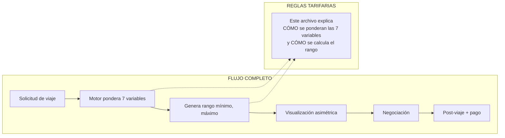

# Reglas Tarifarias

## Motor Tarifario Inteligente — inDrive

<div align="center">

*MVP Lima Metropolitana | Duración: 8 meses | Presupuesto: USD $182,000*

</div>

---

## Índice

1. [Relación con el Flujo de Cálculo](#relación-con-el-flujo-de-cálculo)
2. [Visión General de la Ponderación](#visión-general-de-la-ponderación)
3. [Cálculo del Mínimo (Piso)](#cálculo-del-mínimo-piso)
4. [Cálculo del Máximo (Techo)](#cálculo-del-máximo-techo)
5. [Pesos y Configuración de Variables](#pesos-y-configuración-de-variables)
6. [Ejemplos de Cálculo Paso a Paso](#ejemplos-de-cálculo-paso-a-paso)
7. [Multiplicadores y Factores](#multiplicadores-y-factores)
8. [Reglas de Negocio Aplicadas](#reglas-de-negocio-aplicadas)

---

## Relación con el Flujo de Cálculo

El archivo [`FLUJO_CALCULO_TARIFA.md`](./FLUJO_CALCULO_TARIFA.md) describe **el flujo completo del negocio** (qué pasa en cada etapa). Este archivo (`REGLAS_TARIFAS.md`) se enfoca en el **corazón matemático** del motor: la ponderación de las 7 variables para generar el rango `[mínimo, máximo]`.



---

## Visión General de la Ponderación

El Motor Tarifario Inteligente calcula el rango `[mínimo, máximo]` mediante la **ponderación de 7 variables**, cada una con un peso específico configurable desde el panel administrativo.

### Fórmula general simplificada

```text
mínimo = (Distancia × costo_por_km_base)
        + (Combustible × factor_combustible × distancia)
        + (Capacidad_vehículo × factor_capacidad)
        + (Factor_aprendizaje × histórico_zona)

máximo = mínimo
        + (mínimo × multiplicador_tráfico)
        + (mínimo × factor_hora_demanda)
        + (mínimo × factor_tiempo_estimado)
```

### Límites de seguridad

| Límite | Valor | Descripción |
| :--- | :--- | :--- |
| **Mínimo absoluto** | S/ 3.00 | Tarifa mínima por viaje en Lima |
| **Máximo absoluto** | S/ 150.00 | Tarifa máxima por viaje en Lima |
| **Rango máximo** | Máximo ≤ mínimo × 3.5 | Evita diferencias extremas entre techo y piso |

---

## Cálculo del Mínimo (Piso)

El **mínimo** representa el costo operativo base del viaje más un margen mínimo para el conductor.

### Variables base (influyen directamente en el mínimo)

| Variable | Peso por defecto | Fórmula | Descripción |
| :--- | :--- | :--- | :--- |
| **Distancia** | 40% | `distancia_km × S/ 1.50` | Costo base por kilómetro recorrido |
| **Combustible** | 25% | `precio_galón × consumo_l/km × distancia_km × 0.15` | Impacto del costo de combustible |
| **Capacidad del vehículo** | 20% | `(capacidad_pasajeros - 1) × S/ 0.50` | Vehículos más grandes tienen mayor costo operativo |
| **Histórico (aprendizaje)** | 15% | `precio_promedio_zona × 0.85` | Ajuste basado en viajes similares anteriores |

### Fórmula completa del mínimo

```text
mínimo = (distancia_km × costo_por_km_base)
       + (precio_combustible_por_galon × consumo_por_km × distancia_km × factor_combustible)
       + (max(0, capacidad_pasajeros - 1) × S/ 0.50)
       + (historico_precio_promedio_zona × 0.15)
```

### Ejemplo numérico del mínimo

| Variable | Valor | Cálculo |
| :--- | :--- | :--- |
| Distancia | 8 km | `8 × 1.50 = S/ 12.00` |
| Combustible | S/ 5.50/galón | `5.50 × 0.10 × 8 × 0.25 = S/ 1.10` |
| Capacidad | 4 pasajeros | `(4-1) × 0.50 = S/ 1.50` |
| Histórico zona | S/ 15.00 promedio | `15.00 × 0.15 = S/ 2.25` |
| **Mínimo calculado** | | **S/ 16.85** |
| **Mínimo final (redondeado)** | | **S/ 17.00** |

---

## Cálculo del Máximo (Techo)

El **máximo** se calcula aplicando multiplicadores dinámicos sobre el mínimo calculado.

### Variables dinámicas (influyen en el máximo)

| Variable | Rango | Peso por defecto | Descripción |
| :--- | :--- | :--- | :--- |
| **Tráfico** | 1.0× a 2.0× | 50% | Mayor congestión = mayor multiplicador |
| **Hora / demanda zonal** | 1.0× a 1.5× | 30% | Horas punta y zonas calientes elevan precio |
| **Tiempo estimado** | 1.0× a 1.3× | 20% | Viajes largos en tiempo tienen recargo |

### Fórmula completa del máximo

```text
máximo = mínimo
       + (mínimo × (multiplicador_tráfico - 1) × peso_tráfico)
       + (mínimo × (multiplicador_hora - 1) × peso_hora)
       + (mínimo × (multiplicador_tiempo - 1) × peso_tiempo)
```

### Simplificación práctica (usada en MVP)

```text
máximo = mínimo × factor_dinámico_total

donde:
factor_dinámico_total = 1 + (tráfico_factor × 0.5) + (hora_factor × 0.3) + (tiempo_factor × 0.2)

límite: máximo ≤ mínimo × 2.0 (por tope de tráfico inicial en Lima)
```

### Ejemplo numérico del máximo

| Variable | Valor | Factor | Cálculo |
| :--- | :--- | :--- | :--- |
| Mínimo base | S/ 17.00 | - | - |
| Tráfico | Alto (1.8×) | `(1.8 - 1) × 0.5 = 0.40` | Aumenta 40% sobre mínimo |
| Hora/demanda | 7:00 PM (1.3×) | `(1.3 - 1) × 0.3 = 0.09` | Aumenta 9% sobre mínimo |
| Tiempo estimado | 25 min (1.1×) | `(1.1 - 1) × 0.2 = 0.02` | Aumenta 2% sobre mínimo |
| **Factor total** | | `1 + 0.40 + 0.09 + 0.02 = 1.51` | |
| **Máximo calculado** | | `17.00 × 1.51 = S/ 25.67` | |
| **Máximo final (redondeado)** | | **S/ 26.00** | |
| **Rango final** | | **[S/ 17.00, S/ 26.00]** | |

---

## Pesos y Configuración de Variables

Todos los pesos son **configurables desde el panel administrativo** (CAR-006) sin necesidad de desplegar nuevo código.

### Configuración por defecto (Lima Metropolitana - MVP)

| Variable | Tipo | Peso | Configurable |
| :--- | :--- | :--- | :--- |
| Distancia | Base | 40% | ✅ Sí |
| Combustible | Base | 25% | ✅ Sí |
| Capacidad del vehículo | Base | 20% | ✅ Sí |
| Histórico (aprendizaje) | Base | 15% | ✅ Sí |
| Tráfico | Dinámica | 50% del factor máximo | ✅ Sí |
| Hora / demanda zonal | Dinámica | 30% del factor máximo | ✅ Sí |
| Tiempo estimado | Dinámica | 20% del factor máximo | ✅ Sí |

### Estructura de configuración (JSON)

```json
{
  "version": 1,
  "vigente_desde": "2026-05-01",
  "pesos_variables_base": {
    "distancia": 0.40,
    "combustible": 0.25,
    "capacidad_vehiculo": 0.20,
    "historico": 0.15
  },
  "pesos_variables_dinamicas": {
    "trafico": 0.50,
    "hora_demanda": 0.30,
    "tiempo_estimado": 0.20
  },
  "multiplicadores": {
    "trafico_maximo": 2.0,
    "hora_demanda_maximo": 1.5,
    "tiempo_estimado_maximo": 1.3
  },
  "costos_base": {
    "costo_por_km_pen": 1.50,
    "costo_adicional_capacidad_pen": 0.50,
    "consumo_combustible_por_km": 0.10
  },
  "limites": {
    "minimo_absoluto_pen": 3.00,
    "maximo_absoluto_pen": 150.00,
    "rango_maximo_multiplo": 3.5
  }
}
```

---

## Ejemplos de Cálculo Paso a Paso

### Ejemplo 1: Viaje corto en hora valle

**Condiciones:**
- Distancia: 3 km
- Combustible: S/ 5.00/galón
- Capacidad: 4 pasajeros
- Tráfico: Bajo (1.2×)
- Hora: 2:00 PM (demanda baja, 1.0×)
- Tiempo estimado: 8 min (1.0×)
- Histórico zona: S/ 8.00 promedio

**Cálculo del mínimo:**

| Concepto | Operación | Resultado |
| :--- | :--- | :--- |
| Distancia | `3 × 1.50` | S/ 4.50 |
| Combustible | `5.00 × 0.10 × 3 × 0.25` | S/ 0.38 |
| Capacidad | `(4-1) × 0.50` | S/ 1.50 |
| Histórico | `8.00 × 0.15` | S/ 1.20 |
| **Mínimo** | `4.50 + 0.38 + 1.50 + 1.20` | **S/ 7.58 ≈ S/ 8.00** |

**Cálculo del máximo:**

| Concepto | Operación | Resultado |
| :--- | :--- | :--- |
| Tráfico | `1 + (1.2 - 1) × 0.5 = 1.10` | +10% |
| Hora | `1 + (1.0 - 1) × 0.3 = 1.00` | +0% |
| Tiempo | `1 + (1.0 - 1) × 0.2 = 1.00` | +0% |
| **Factor total** | `1.10` | - |
| **Máximo** | `8.00 × 1.10` | **S/ 8.80 ≈ S/ 9.00** |

**Resultado final:** `[S/ 8.00, S/ 9.00]`

---

### Ejemplo 2: Viaje largo en hora punta con tráfico pesado

**Condiciones:**
- Distancia: 12 km
- Combustible: S/ 5.50/galón
- Capacidad: 4 pasajeros
- Tráfico: Muy alto (1.9×)
- Hora: 7:00 PM (demanda alta, 1.4×)
- Tiempo estimado: 45 min (1.2×)
- Histórico zona: S/ 25.00 promedio

**Cálculo del mínimo:**

| Concepto | Operación | Resultado |
| :--- | :--- | :--- |
| Distancia | `12 × 1.50` | S/ 18.00 |
| Combustible | `5.50 × 0.10 × 12 × 0.25` | S/ 1.65 |
| Capacidad | `(4-1) × 0.50` | S/ 1.50 |
| Histórico | `25.00 × 0.15` | S/ 3.75 |
| **Mínimo** | `18.00 + 1.65 + 1.50 + 3.75` | **S/ 24.90 ≈ S/ 25.00** |

**Cálculo del máximo:**

| Concepto | Operación | Resultado |
| :--- | :--- | :--- |
| Tráfico | `1 + (1.9 - 1) × 0.5 = 1.45` | +45% |
| Hora | `1 + (1.4 - 1) × 0.3 = 1.12` | +12% |
| Tiempo | `1 + (1.2 - 1) × 0.2 = 1.04` | +4% |
| **Factor total** | `1.45 + 1.12 + 1.04 - 2 = 1.61` | - |
| **Máximo** | `25.00 × 1.61` | **S/ 40.25 ≈ S/ 40.00** |

**Resultado final:** `[S/ 25.00, S/ 40.00]`

---

## Multiplicadores y Factores

### Tabla de multiplicadores por condición

| Condición | Tráfico | Hora/Demanda | Tiempo estimado |
| :--- | :--- | :--- | :--- |
| **Muy bajo** | 1.0× | 1.0× | 1.0× |
| **Bajo** | 1.2× | 1.1× | 1.0× |
| **Normal** | 1.4× | 1.2× | 1.1× |
| **Alto** | 1.6× | 1.3× | 1.2× |
| **Muy alto** | 1.9× | 1.5× | 1.3× |
| **Extremo (tope)** | **2.0×** | 1.5× | 1.3× |

### Factor de hora / demanda zonal (Lima Metropolitana)

| Franja horaria | Días laborables | Fines de semana |
| :--- | :--- | :--- |
| 06:00 - 08:00 | 1.2× | 1.0× |
| 08:00 - 10:00 | 1.4× | 1.1× |
| 10:00 - 17:00 | 1.0× | 1.0× |
| 17:00 - 19:00 | 1.3× | 1.2× |
| 19:00 - 21:00 | 1.5× | 1.4× |
| 21:00 - 23:00 | 1.3× | 1.3× |
| 23:00 - 06:00 | 1.1× | 1.1× |

---

## Reglas de Negocio Aplicadas

### Resumen de reglas implementadas

| Regla | Descripción | Aplicación |
| :--- | :--- | :--- |
| **Regla 1** | El mínimo nunca puede ser menor a S/ 3.00 | `mínimo = max(mínimo, 3.00)` |
| **Regla 2** | El máximo nunca puede ser mayor a S/ 150.00 | `máximo = min(máximo, 150.00)` |
| **Regla 3** | El rango no puede ser extremadamente amplio | `máximo ≤ mínimo × 3.5` |
| **Regla 4** | El multiplicador de tráfico tiene tope ×2.0 | `trafico_factor = min(trafico_factor, 2.0)` |
| **Regla 5** | Capacidad del vehículo solo eleva el mínimo | No afecta al máximo directamente |
| **Regla 6** | El histórico solo afecta al mínimo | El aprendizaje no influye en el techo |

### Validaciones automáticas

```text
ANTES de entregar el rango al usuario, el sistema valida:

1. ¿mínimo ≤ máximo? → Si no, invertir o ajustar
2. ¿mínimo ≥ 3.00? → Si no, forzar mínimo = 3.00
3. ¿máximo ≤ 150.00? → Si no, forzar máximo = 150.00
4. ¿máximo ≤ mínimo × 3.5? → Si no, ajustar máximo
```

<div align="center">

---

**Reglas Tarifarias — Motor Tarifario Inteligente inDrive** | *Mayo 2026*

</div>
