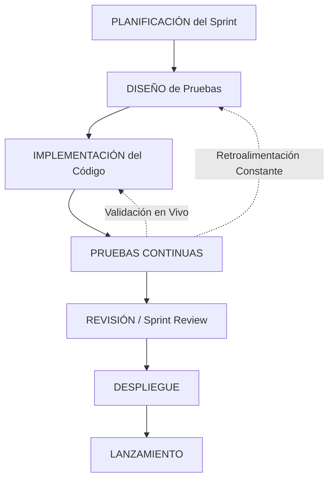

# Metodología de Testing Ágil (Agile Testing)

**Proyecto:** Motor Tarifario Inteligente para inDrive en Lima Metropolitana  
**Entorno de Calidad:** inDrive+ (Mobile App + Admin Dashboard + Backend APIs)  
**Marco Conceptual:** Basado en los estándares de la Asociación Internacional de Calidad de Software (AICS).

---

## 1. Fundamentos y Principios del Método Ágil en inDrive+

En concordancia con los principios fundamentales del **Método Ágil (Agile)**, el desarrollo de software y las pruebas en el proyecto **inDrive+** no se conciben como etapas secuenciales aisladas, sino como un **proceso continuo, versátil y flexible** que permite la entrega constante de valor en incrementos cortos de desarrollo (Sprints).

Aplicamos los siguientes valores esenciales en la estrategia de calidad de nuestro motor tarifario:

*   **Adaptabilidad a Situaciones en Constante Cambio:** Las fórmulas del motor tarifario (como los pesos de tráfico y combustible) y los parámetros de red (CORS, IPs) están sujetos a variaciones frecuentes según las condiciones operativas de Lima Metropolitana. El testing ágil nos permite ajustar, refactorizar y verificar mejoras en caliente en cada Sprint de forma rápida y controlada.
*   **Interacción y Colaboración Continua:** Durante todo el ciclo de desarrollo, los desarrolladores de la app móvil y del panel administrativo colaboran activamente en las pruebas de integración con el backend, eliminando silos informativos y logrando ciclos cortos de feedback.
*   **Identificación Temprana de Dificultades:** A través de la ejecución constante de pruebas al culminar incrementos funcionales, se detectan fallos críticos de manera oportuna (por ejemplo, errores de comunicación de WebSockets o deserialización de DTOs), reduciendo el costo de reparación.
*   **Centrado en el Usuario:** El marco de pruebas valida constantemente el valor real percibido:
    *   **Pasajero:** Verificación de que visualice siempre su precio máximo estimado (techo/máx).
    *   **Conductor:** Verificación de que visualice siempre su ganancia mínima requerida (piso/mín).
*   **Mentalidad de Calidad Compartida (Funciones Multifacéticas):** Todo el equipo asume responsabilidades de prueba. El desarrollador de la app móvil y el del backend validan mutuamente sus interfaces (contratos de API) mediante pruebas unitarias y de integración cruzadas.

---

## 2. Ciclo de Pruebas Continuas (Continuous Testing Lifecycle)

Siguiendo el flujo interactivo de la metodología ágil, el testing se encuentra en el **centro** de las actividades del ciclo de vida del Sprint de desarrollo de **inDrive+**:

### 📋 2.1 Fases del Ciclo de Vida del Testing en inDrive+

1.  **Planificación (Planning):** 
    Se definen los criterios de aceptación y escenarios límite de las Historias de Usuario (HUs). Por ejemplo, para la **HU-07** (Cálculo del rango de tarifas con 7 variables), se planifican los valores de prueba esperados en soles (S/) para distancias cortas, medias y largas.
2.  **Diseño (Design):**
    Se diseñan los casos de prueba unitarios (Jest) y las solicitudes de prueba de APIs (colecciones de Postman) en paralelo con el diseño de la base de datos y la arquitectura de microservicios.
3.  **Implementación (Implementation):**
    Se escribe el código del componente y, simultáneamente, se codifican los archivos de prueba (`.spec.ts`) correspondientes para asegurar la cobertura inmediata de la funcionalidad construida.
4.  **Pruebas Continuas (Continuous Testing - El Núcleo):**
    Es la actividad central e integrada. Comprende la ejecución automática de la suite de pruebas unitarias y de análisis de dependencias (SCA) en el entorno local antes de mergear cambios funcionales a la rama `main` o `release`.
5.  **Revisión (Review):**
    Durante el Sprint Review, se realiza la validación cruzada y demostración de los flujos de usuario (por ejemplo, el flujo asimétrico de negociación de viajes entre pasajero y conductor).
6.  **Despliegue & Lanzamiento (Deploy & Release):**
    Una vez integradas y validadas todas las pruebas, se empaqueta la aplicación (APK de desarrollo para la app móvil / Contenedores Docker para el backend) y se liberan las versiones incrementales listas para producción.

---

## 3. Enfoques Estratégicos del Testing Ágil en inDrive+

El modelo ágil adoptado combina dos orientaciones fundamentales de control:

### 🛡️ 3.1 Enfoque Preventivo (Shift-Left Testing)
Nos enfocamos en prevenir errores de diseño y contratos antes de que el código llegue a ejecución:
*   **Tipado Estricto de Contratos (TypeScript):** La activación de `strict: true` en el compilador de TypeScript actúa como la primera capa preventiva de pruebas; incompatibilidades entre los DTOs de comunicación del móvil y del backend son capturadas en tiempo de desarrollo.
*   **Análisis de Composición de Software (SCA):** Escaneos tempranos de seguridad en dependencias (`npm audit`) en el móvil y backend para evitar la integración de librerías vulnerables (como fugas de memoria o inyecciones CRLF) antes del empaquetado.

### 🔧 3.2 Enfoque Correctivo y Pruebas de Regresión
Aseguramos la corrección continua y la estabilidad de las funcionalidades preexistentes:
*   **Pruebas Unitarias de Regresión (Jest):** Contamos con una suite automatizada de **33 pruebas en 7 suites críticas** que se ejecutan en pocos segundos. Esto garantiza que modificaciones posteriores (por ejemplo, la adición de rate-limiting) no corrompan la lógica matemática del motor tarifario de `ms-pricing` o la máquina de estados de viajes en `ms-base`.
*   **Ciclos Breves de Retroalimentación (Smoke Tests):** Verificación rápida de la integración de bases de datos y microservicios levantando el entorno completo mediante Docker local (`./start.sh`) y realizando peticiones rápidas (`curl`) para probar registro y cotización.

---

## 4. Matriz de Cobertura Ágil (Trazabilidad)

| Fase / Iteración | Tipo de Prueba | Componente Auditado | Criterio de Aceptación Verificado |
| :--- | :--- | :--- | :--- |
| **Sprint 1 & 2** | Unitarias (Jest) | `ms-pricing` / `ms-base` | Valida la asimetría de precios por rol en tiempo real y la consistencia matemática de la fórmula de 7 variables. |
| **Sprint 2** | SCA (`npm audit`) | `indrive-mobile` / `indrive-plus` | Escaneo y listado de vulnerabilidades en dependencias antes de generar la build del incremento. |
| **Smoke Test (E2E)** | Integración Manual | API Gateway / Móvil / BDs | Simulación completa en caliente del flujo de registro, cotización, negociación bilateral con WebSockets, y tracking de GPS. |
| **Review** | Saneamiento SAST | `admin-panel` | Validación del escape HTML contra inyecciones XSS en conductores, logs y auditorías. |
