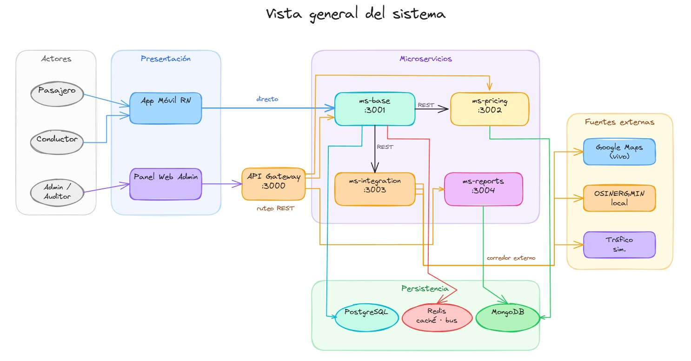
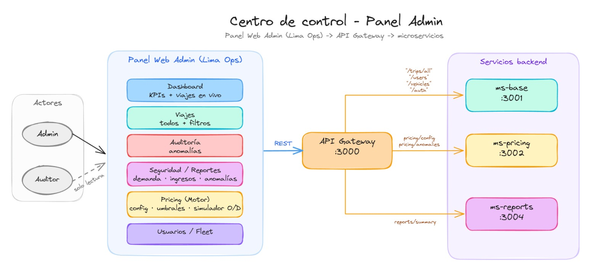
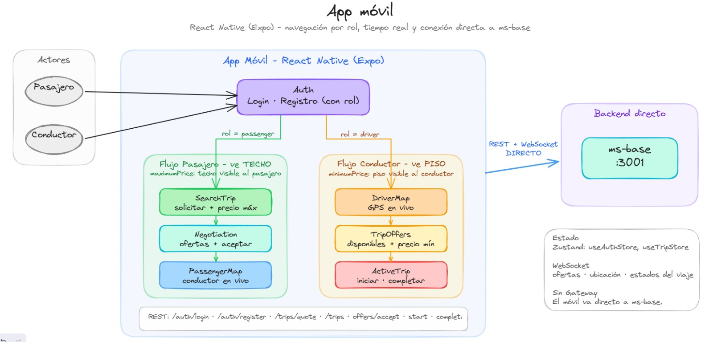

# Arquitectura del Sistema — Motor Tarifario Inteligente inDrive+

> Resumen de la arquitectura por componente, con su diagrama y el **porqué** de cada decisión.

---

## 1. Vista general

Arquitectura de **microservicios** con **persistencia poliglota**. Tres actores entran por dos superficies:

- **Pasajero / Conductor → App Móvil** (REST + WebSocket **directo a `ms-base`**).
- **Admin / Auditor → Panel Web** (a través del **API Gateway**).

Capas: **Presentación** → **API Gateway :3000** (JWT, ruteo del panel) → **Microservicios** (`ms-base`, `ms-pricing`, `ms-integration`, `ms-reports`) → **Persistencia** (PostgreSQL · MongoDB · Redis) → **Fuentes externas** (Google Maps en vivo · OSINERGMIN local · tráfico simulado).

---

## 2. Backend + Base de Datos

Cada servicio tiene **responsabilidad y datos propios**:

- **`ms-base` :3001** — auth, usuarios, vehículos, viajes (máquina de estados), negociación y WebSocket. → **PostgreSQL** (transaccional) + **Redis** (sesiones/caché).
- **`ms-pricing` :3002** — motor de 7 variables, regla de pago, anomalías y config dinámica. → **MongoDB**. **Publica eventos** al bus.
- **`ms-integration` :3003** — fuentes externas con **circuit breaker** (lo invoca `ms-base`).
- **`ms-reports` :3004** — reportes como **read-model por eventos** (CQRS). → **MongoDB**.

**Eventos (Redis Pub/Sub):** `ms-pricing` publica `pricing.calculated` · `pricing.settled` · `anomaly.detected`; los consumen la **auditoría de `ms-pricing`** y **`ms-reports`**.
*(El tiempo real hacia el móvil va por **WebSocket desde `ms-base`**, no por este bus.)*

---

## 3. Centro de control — Panel Admin

Panel web (Lima Ops) para **Admin** (acceso total) y **Auditor** (solo lectura). Entra por el **Gateway** y consume:

| Módulo | Endpoint | Servicio |
| --- | --- | --- |
| Dashboard / Viajes | `GET /trips/all` | ms-base |
| Auditoría de anomalías | `GET /pricing/anomalies` | ms-pricing |
| Pricing (config · umbrales · simulador O/D) | `GET/PUT /pricing/config` | ms-pricing |
| Seguridad / Reportes | `GET /reports/summary` | ms-reports |
| Usuarios / Fleet | `/users` · `/vehicles` | ms-base |

Es el **único punto que ve el rango completo** `[mín, máx]`; el resto de la plataforma es asimétrico.

---

## 4. App móvil

React Native (Expo). **Navegación por rol** y conexión **directa a `ms-base`** (REST + WebSocket), sin pasar por el Gateway.

- **Pasajero (ve TECHO):** SearchTrip → Negotiation → PassengerMap.
- **Conductor (ve PISO):** DriverMap → TripOffers → ActiveTrip.
- Estado con **Zustand**; tiempo real (ofertas, ubicación del conductor, estados del viaje) por **WebSocket**.

---

## 5. Justificación de decisiones (el porqué)

| Decisión | Por qué | Alternativa descartada |
| --- | --- | --- |
| **Microservicios** | Escalado y despliegue independientes; aísla fallos | Monolito (difícil escalar/aislar) |
| **BD poliglota** | Postgres = ACID para pago/viajes · Mongo = schemaless para auditoría/histórico · Redis = latencia <5 s + bus | Una sola BD (no cubre los 3 perfiles) |
| **Redis Pub/Sub como bus** | Ya está en el stack; simple para el MVP; desacopla auditoría/reportes | RabbitMQ (más infraestructura → roadmap) |
| **Visualización asimétrica** | Diferencial del producto: protege la negociación (techo/piso) | Mostrar el rango completo a ambos |
| **Móvil directo a `ms-base`** | El Gateway no proxea WebSocket; menor latencia | Móvil vía Gateway (rompe el WS) |
| **Circuit breaker en integración** | Degradación elegante ante fallos de APIs externas (CAR-010) | Llamada directa sin protección |

> Detalle ampliado de cada decisión en [`decisiones_arquitectonicas.md`](../../Aquitectura/decisiones_arquitectonicas.md) (ADRs).
