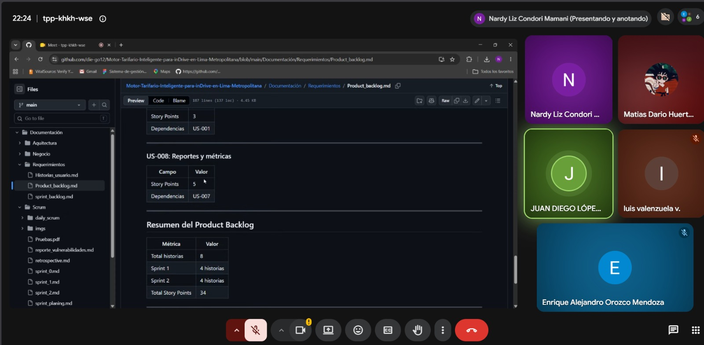

# Daily Scrum 2 – Sprint 2

**Proyecto:** Motor Tarifario Inteligente para inDrive en Lima Metropolitana

**Fecha:** 16/06/2026

**Hora:** 10:00 PM

**Duración:** 20 minutos

# Participantes

| Integrante | Rol |
|------------|------|
| Juan Diego| Backend |
| Luis Valenzuela | Data Base|
| Enrique Orozco| DevOps |
| Matias Dario | Aplicación móvil |
| Nardy Condori| Integración y pruebas |
---

## Avances del equipo

### Backend

**¿Qué hice?**

* Implementé el microservicio de cálculo tarifario.
* Configuré los endpoints para consultar tarifas estimadas.

**¿Qué haré?**

* Integrar el servicio con la base de datos.
* Realizar pruebas unitarias.

**¿Tengo impedimentos?**

* Se requiere definir el formato definitivo de las respuestas de la API.

---

### Aplicación móvil

**¿Qué hice?**

* Diseñé la interfaz de solicitud de viaje.
* Implementé la visualización del rango tarifario.

**¿Qué haré?**

* Integrar la aplicación con los servicios del backend.
* Validar la experiencia de usuario.

**¿Tengo impedimentos?**

* Dependencia de la disponibilidad de los endpoints del backend.

---

### Base de datos

**¿Qué hice?**

* Diseñé las tablas para almacenar el historial de cálculos.
* Configuré la persistencia de datos.

**¿Qué haré?**

* Optimizar consultas.
* Validar la integridad de la información.

**¿Tengo impedimentos?**

* Definir el esquema final para el histórico de tarifas.

---

###  Infraestructura y DevOps

**¿Qué hice?**

* Configuré los contenedores Docker.
* Gestioné las variables de entorno.

**¿Qué haré?**

* Automatizar el despliegue del entorno de desarrollo.
* Documentar la configuración del sistema.

**¿Tengo impedimentos?**

* Ajustar la comunicación entre los servicios desplegados.

---

### Integración y pruebas

**¿Qué hice?**

* Elaboré los casos de prueba iniciales.
* Verifiqué la comunicación entre los componentes del sistema.

**¿Qué haré?**

* Ejecutar pruebas de integración.
* Registrar incidencias y dar seguimiento a los errores identificados.

**¿Tengo impedimentos?**

* Se requiere contar con una versión estable de los servicios para completar las pruebas.

---

## Acuerdos de la reunión

* Priorizar la integración entre la aplicación móvil y el backend.
* Definir los contratos de la API antes de la siguiente reunión.
* Documentar los cambios realizados durante el sprint.
* Registrar y dar seguimiento a los impedimentos identificados.

---

## Evidencia de la reunión

> Evidencia de la reunión 2.

