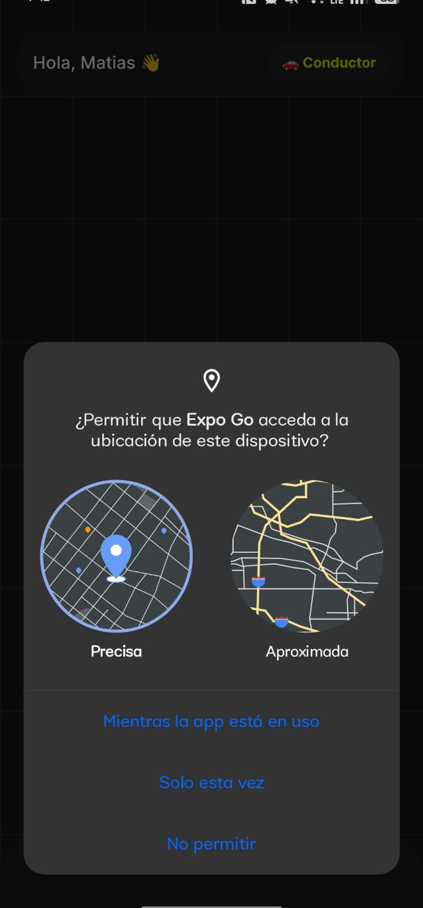
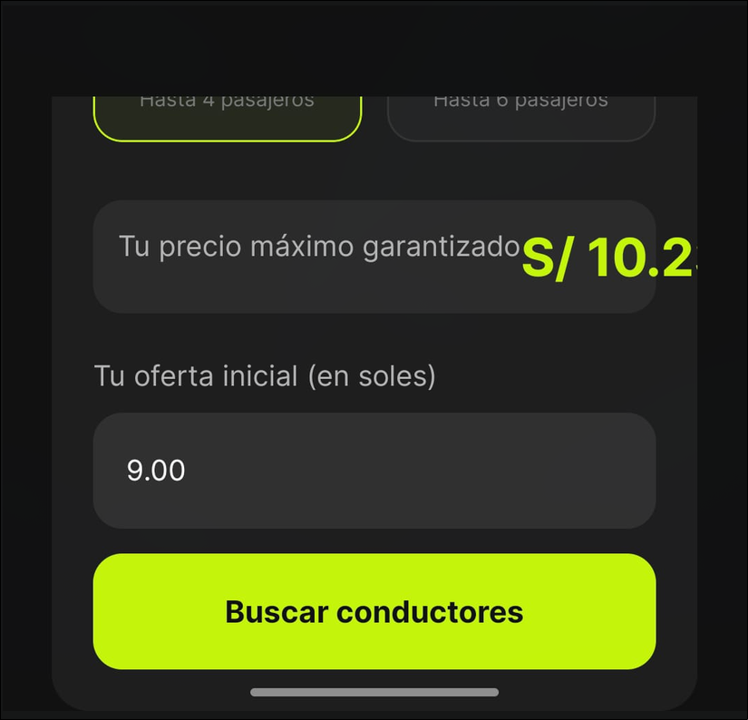
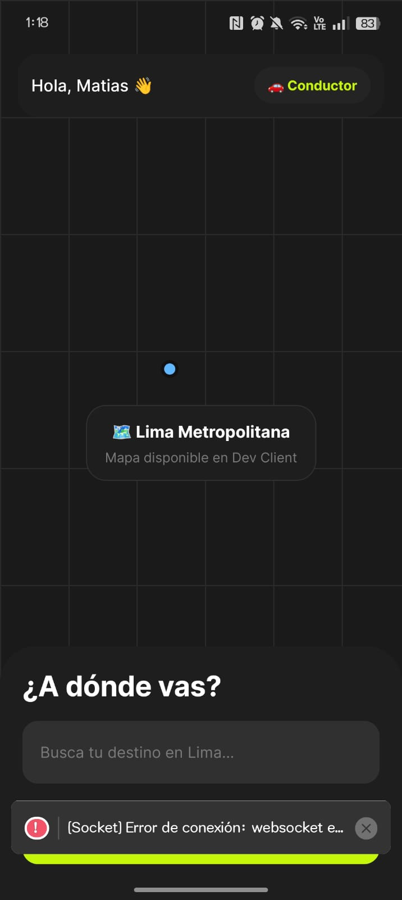
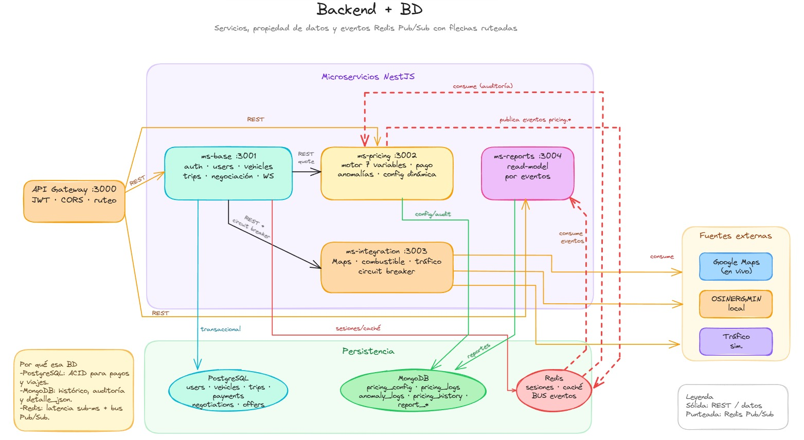

# Retroespective – Sprint 2

## Aspectos positivos

- Se logró avanzar en la implementación del MVP según la planificación establecida.
- La arquitectura basada en microservicios facilitó la distribución de tareas.
- El uso de Docker simplificó la configuración del entorno de desarrollo.
- Se mantuvo una comunicación constante entre los integrantes del equipo.

---

## Dificultades encontradas

- La integración entre la aplicación móvil y los microservicios presentó ajustes adicionales.
- La configuración de variables de entorno generó diferencias entre equipos de desarrollo.
- Se identificaron desafíos relacionados con la simulación de servicios externos.

---

## Lecciones aprendidas

- Documentar la configuración inicial reduce errores de integración.
- Definir contratos de API desde etapas tempranas agiliza el desarrollo.
- Mantener reuniones cortas y frecuentes mejora la coordinación del equipo.

---

## Acciones a mejorar

- Incrementar la cobertura de pruebas.
- Automatizar validaciones en el flujo de integración continua.
- Estandarizar la configuración de los entornos de desarrollo.

---

## 🛠️ Reporte del Proceso de Pulido e Integración del Sistema

A continuación se detallan las principales dificultades encontradas en el desarrollo y refinamiento del sistema (tanto en la aplicación móvil como en el backend), comentando las soluciones aplicadas de manera simplificada e incorporando las imágenes de evidencia.

### Desafío 1: Sincronización del Precio de Acuerdo Final (Bilateral)
*   **Dificultad:** Al confirmarse la oferta mutua entre pasajero y conductor, el precio acordado no persistía ni se visualizaba en las pantallas de espera. La aplicación cargaba valores calculados asimétricamente por defecto (el máximo para el pasajero y el mínimo para el conductor).
*   **Solución:** Se persistió el valor de la oferta aceptada en la base de datos PostgreSQL mediante el servicio de viajes al momento de la asignación. Esta información se expuso a través del payload de WebSockets para actualizar en tiempo real las pantallas de espera de ambos extremos. Además, se configuró la modal de cobro final del conductor para que se autocompletara automáticamente con este precio acordado.
*   **Evidencias:**
    *   *Detalles del viaje en la app del pasajero:*  
        
    *   *Transición animada de viaje asignado en la app del conductor:*  
        
    *   *Comprobación de sincronización y cobro:*  
        
        
        

---

### Desafío 2: Control de Sesiones y Permisos por Roles (Auditor vs. Administrador)
*   **Dificultad:** Evitar que los usuarios con rol de "Auditor" modificaran variables tarifarias o eliminaran registros de flota y usuarios, sin bloquearles el acceso de lectura a los dashboards financieros y métricas agregadas.
*   **Solución:** Se implementó una validación doble. En el frontend se deshabilitan e invisibilizan los botones de edición/creación para el rol auditor y se añade un banner superior de aviso. En el backend se protegieron los métodos `POST`, `PATCH` y `DELETE` para rechazar operaciones de auditoría con código HTTP 403.
*   **Evidencia:**  
    

---

### Desafío 3: Geolocalización en Tiempo Real y Trazado de Rutas en Lima Metropolitana
*   **Dificultad:** La visualización del mapa y la actualización del recorrido del conductor en dispositivos físicos o simuladores generaba inestabilidad o demoras de renderizado.
*   **Solución:** Se estandarizó la integración de Google Maps mediante un componente unificado (`MapViewCompatible`) que procesa dinámicamente las coordenadas y actualiza la polilínea del recorrido real en segundo plano sin interrumpir la UI.
*   **Evidencias:**
    *   *Trazado de ruta en el simulador:*  
        
    *   *Inicio de ruta activa:*  
        

---

### Desafío 4: Orquestación de Microservicios Locales mediante Docker
*   **Dificultad:** Administrar 9 contenedores concurrentes (bases de datos, pasarelas de enlace y 5 microservicios individuales de la app) requería configuraciones de red y dependencias sumamente complejas.
*   **Solución:** Se agrupó la infraestructura con `docker-compose`, asignando nombres DNS y redes internas estables. Se crearon políticas de espera (*healthchecks*) para asegurar que PostgreSQL y Redis cargaran antes que las APIs de NestJS.
*   **Evidencias:**
    *   *Estado de contenedores:*  
        
    *   *Conexión a bases de datos:*  
        
    *   *Diagrama e interacción general:*  
        

---

## Variables consideradas en el motor tarifario

| Variable                     | Fuente                                       | Justificación                                                                    |
| ---------------------------- | -------------------------------------------- | -------------------------------------------------------------------------------- |
| Distancia del trayecto       | Google Maps                                  | Permite calcular el costo base del viaje.                                        |
| Precio del combustible       | Dataset de OSINERGMIN                        | Refleja las variaciones del costo operativo del conductor.                       |
| Capacidad del vehículo       | Perfil del vehículo                          | Ajusta la tarifa según el tipo y tamaño del vehículo.                            |
| Condición del tráfico        | Simulación inicial                           | Permite estimar retrasos y costos adicionales.                                   |
| Hora del día y demanda zonal | Reloj del sistema y factor dinámico por zona | Modela el comportamiento de la oferta y demanda.                                 |
| Tiempo estimado del viaje    | Google Maps                                  | Complementa el cálculo considerando la duración del servicio.                    |
| Histórico de la zona         | Base de datos                                | Permite identificar patrones de comportamiento y optimizar estimaciones futuras. |

## Observaciones 

### Métricas Scrum obligatorias

Para el Sprint 2 se deben presentar las siguientes métricas:

* Product Backlog actualizado.
* Sprint Backlog.
* Velocity del equipo.
* Historias de usuario completadas.
* Historias de usuario pendientes.

### Justificación de decisiones técnicas

Durante la exposición se deben responder las siguientes preguntas:

* ¿Por qué se eligió una arquitectura basada en microservicios?
* ¿Por qué se seleccionó la base de datos actual?
* ¿Qué patrones de diseño se implementaron?
* ¿Qué alternativas se evaluaron y descartaron?

### Retrospectiva del Sprint

#### ¿Qué funcionó?

* La distribución de tareas entre los integrantes del equipo.
* La implementación inicial del motor tarifario.
* La comunicación continua mediante reuniones periódicas.

#### ¿Qué falló?

* La integración entre algunos componentes del sistema.
* La configuración de entornos de desarrollo.
* La definición inicial de contratos entre servicios.

#### ¿Qué mejoraremos?

* Incrementar la cobertura de pruebas.
* Documentar las APIs desde etapas tempranas.
* Estandarizar los entornos mediante contenedores.
* Implementar métricas automáticas de seguimiento.

Conclusiones

El Sprint 2 permitió consolidar la base funcional del motor tarifario inteligente y evidenció la importancia de fortalecer la integración entre los distintos componentes del sistema.

