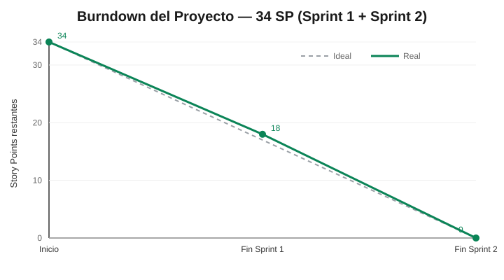
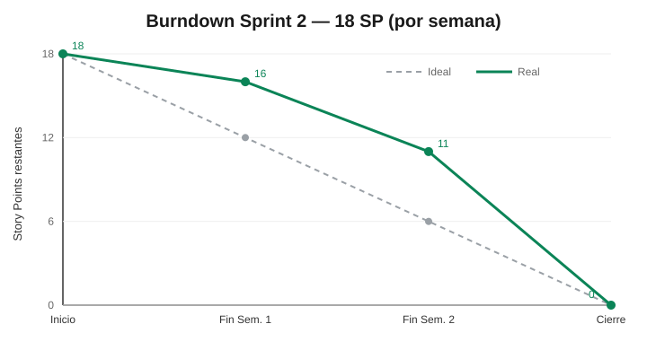

# Cierre del Proyecto — Gestión Scrum (Sprint Final)

> Vista única y visible de la gestión ágil del proyecto **Motor Tarifario Inteligente — inDrive+**.
> Consolida las métricas de los dos sprints. El detalle por sprint está en
> [Sprint 1](Sprints/sprint_1.md) y [Sprint 2](Sprints/sprint_2.md).

---

## 1. Resumen del proyecto

| Dato | Valor |
| --- | --- |
| Sprints ejecutados | 2 |
| Historias de usuario | 8 (US-001 … US-008) |
| Story Points totales | 34 SP |
| Historias completadas | **8 / 8** |
| Velocity promedio | **17 SP/sprint** |
| Ítems diferidos a roadmap | 2 (alcance ajustado) + roadmap post-MVP |

---

## 2. Burndown Chart

### Del proyecto (34 SP)

El equipo cerró cada sprint con **todo el compromiso entregado** (16 SP en el Sprint 1 y 18 SP en el Sprint 2), llevando el trabajo restante del proyecto de 34 → 18 → 0 SP.

### Del Sprint 2 (por semana)

La línea **real** se mantuvo por encima de la ideal durante las primeras semanas porque el avance fue mayormente local y la integración a `main` se concentró hacia el cierre — es una de las lecciones aprendidas (ver §6).

---

## 3. Velocity

| Sprint | Comprometidos (SP) | Completados (SP) | Estado |
| --- | --- | --- | --- |
| Sprint 1 — Fase Pre-viaje | 16 | 16 | ✅ Completado |
| Sprint 2 — Post-viaje + Administración | 18 | 18 | ✅ Completado |
| **Total** | **34** | **34** | — |

**Velocity promedio: 17 SP/sprint.**

---

## 4. Historias de usuario completadas

| US | Título | Sprint | SP | Estado |
| --- | --- | --- | --- | --- |
| US-001 | Solicitud de viaje con cálculo de rango | 1 | 5 | ✅ Completada |
| US-002 | Visualización asimétrica del precio | 1 | 4 | ✅ Completada |
| US-003 | Negociación acotada dentro del rango | 1 | 4 | ✅ Completada |
| US-004 | Aceptación bilateral e inicio de viaje | 1 | 3 | ✅ Completada |
| US-005 | Recálculo post-viaje | 2 | 5 | ✅ Completada — *alcance ajustado* |
| US-006 | Regla de pago invariante | 2 | 5 | ✅ Completada |
| US-007 | Configuración de parámetros desde panel admin | 2 | 3 | ✅ Completada |
| US-008 | Visualización de reportes y métricas | 2 | 5 | ✅ Completada — *alcance ajustado* |

**8 de 8 historias liberadas al Incremento (34 SP).** El detalle de criterios de aceptación está en [Historias de Usuario](../Requerimientos/Historias_usuario.md).

---

## 5. Historias / alcance pendiente y su justificación

Al ser el último sprint del curso, lo no entregado se documenta como **roadmap** (no como *carryover*). Las historias US-005 y US-008 se entregaron con su **valor central**, difiriendo partes específicas:

| Ítem pendiente | Historia | Por qué se difirió | Destino |
| --- | --- | --- | --- |
| Recálculo con **GPS real** (hoy: precio real ingresado por el conductor) | US-005 | Infraestructura de captura GPS no disponible en el MVP | Roadmap |
| **Reportes avanzados** por zona/franja horaria y filtros | US-008 | Alcance y tiempo del MVP | Roadmap |
| **Surge pricing real** (oferta/demanda en vivo) | CAR-001 | Requiere volumen de datos en tiempo real | Roadmap |
| Integración **en vivo** OSINERGMIN / API de tráfico real | CAR-009 | OSINERGMIN no expone API pública; se usó dato real local | Roadmap |
| Migración bus de eventos **Redis Pub/Sub → RabbitMQ** | ADR-005 | El bus actual cubre el MVP; RabbitMQ es evolución | Roadmap |
| **OpenSearch** para logs / **MFA** de administrador | CAR-007 / seguridad | Fuera del alcance temporal del MVP | Roadmap |

Justificación ampliada en [Gestión de Cambio](../Presentacion_Final/gestion_de_cambio.md) y [Product Backlog — roadmap](../Requerimientos/Product_backlog.md).

---

## 6. Retrospectiva del equipo (cierre del proyecto)

> Síntesis de las retrospectivas de [Sprint 1](Retrospectivas/retrospective.md) y [Sprint 2](Retrospectivas/retrospective2.md).

### ✅ Qué funcionó
- La **división por microservicios/dominios** permitió avanzar en paralelo sin bloquearse.
- **Docker Compose** dio un entorno reproducible para todo el equipo.
- Comunicación constante mediante reuniones periódicas.
- El **motor tarifario** quedó funcional e integrado, y la **visualización asimétrica** por rol operó de punta a punta.

### 🔧 Qué mejoraríamos
- La **integración móvil ↔ backend** se afinó tarde; los **contratos de API** se definieron sobre la marcha.
- Las **variables de entorno** (`.env`/`HOST_IP`) generaron diferencias entre equipos.
- Falta de **revisión temprana de PRs** y de **cobertura de pruebas** automatizada.

### 💡 Principales aprendizajes
- **Documentar la configuración inicial** reduce errores de integración.
- **Definir contratos de API temprano** agiliza el desarrollo paralelo.
- **Dailies cortos y frecuentes** mejoran la coordinación.
- **Integrar de forma continua** (no al cierre) suaviza el burndown.
- La **separación por dominios** acelera el desarrollo pero exige contratos claros entre servicios.

---

## 7. Riesgos y dificultades del desarrollo

### Matriz de riesgos

| Riesgo | Probabilidad | Impacto | Mitigación | Estado |
| --- | --- | --- | --- | --- |
| Dependencia de APIs externas (combustible/tráfico/Maps) | Media | Alto | Modo simulado + dato real local; circuit breaker | Mitigado |
| Divergencia entre ramas de larga vida | Alta | Medio | Sincronización frecuente con `main` y PRs revisados | Mitigado |
| Rango tarifario inválido | Media | Alto | Topes (×2.0, S/3–150) + spread mínimo + pruebas del motor | Mitigado |
| Diferencias de entorno entre desarrolladores | Alta | Medio | Variables por entorno, guía de configuración y Docker | Mitigado |
| Integración móvil ↔ backend concentrada al cierre | Media | Medio | Contratos de API por rol y pruebas | Controlado |

### Principales dificultades técnicas (y cómo se resolvieron)

1. **Sincronización del precio pactado (bilateral):** el precio acordado no persistía en las pantallas de espera → se persistió la oferta aceptada en PostgreSQL y se propagó por WebSocket a ambos roles.
2. **Permisos Auditor vs. Administrador:** evitar que el auditor edite sin bloquear su lectura → validación doble (UI oculta acciones + backend responde 403 a `POST/PATCH/DELETE`).
3. **Geolocalización y trazado de rutas en Lima:** inestabilidad de render → componente unificado `MapViewCompatible` que actualiza la polilínea en segundo plano.
4. **Orquestación de 9 contenedores Docker:** red y dependencias complejas → `docker-compose` con DNS internos y *healthchecks* (Postgres/Redis listos antes que las APIs).

Detalle con evidencias en [retrospective2.md](Retrospectivas/retrospective2.md).
