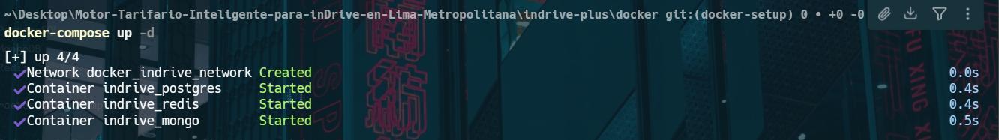

# Sprint 1 – Fase Pre-Viaje

## Información General

**Proyecto:** Motor Tarifario Inteligente para inDrive en Lima Metropolitana

**Sprint:** Sprint 1

**Objetivo General**

Implementar la fase Pre-Viaje del sistema, permitiendo que un pasajero solicite un viaje, el motor tarifario calcule un rango de precios, ambas partes negocien dentro de dicho rango y finalmente acepten la propuesta para iniciar el trayecto.

---

# Historias de Usuario Incluidas

| ID     | Historia                                | Prioridad |
| ------ | --------------------------------------- | --------- |
| US-001 | Solicitud de viaje con cálculo de rango | Alta      |
| US-002 | Visualización asimétrica del precio     | Alta      |
| US-003 | Negociación acotada dentro del rango    | Alta      |
| US-004 | Aceptación bilateral e inicio del viaje | Alta      |

---

# Objetivos del Sprint

Durante este sprint se busca:

* Implementar la solicitud de viajes.
* Calcular automáticamente el rango tarifario.
* Integrar datos externos para el cálculo.
* Mostrar precios de forma asimétrica.
* Implementar la negociación entre pasajero y conductor.
* Registrar las ofertas realizadas.
* Permitir la aceptación bilateral.
* Iniciar el viaje formalmente.
* Preparar el sistema para la fase Post-Viaje.

---

# Componentes Desarrollados

## Frontend Móvil

### Tecnologías

* React Native
* Expo
* TypeScript
* React Native Maps / Mapbox

### Funcionalidades

#### Pasajero

* Selección de origen y destino.
* Solicitud de viaje.
* Visualización del precio máximo permitido.
* Envío de ofertas.
* Aceptación de negociación.

#### Conductor

* Recepción de solicitudes.
* Visualización del precio mínimo permitido.
* Envío de contraofertas.
* Confirmación del viaje.

---

## Backend Base

### Tecnología

* NestJS

### Funcionalidades

#### Gestión de Viajes

* Crear solicitud de viaje.
* Validar información recibida.
* Administrar estados del viaje.

Estados:

* Buscando
* Negociando
* Asignado
* En Curso
* Finalizado

#### Gestión de Usuarios

* Pasajeros
* Conductores

#### Gestión de Ofertas

* Registro de propuestas.
* Validación de límites.
* Confirmación bilateral.

---

## Motor Tarifario Inteligente

### Tecnología

* NestJS

### Funcionalidades

#### CAR-001

Cálculo del rango pre-viaje utilizando:

1. Distancia estimada
2. Tiempo estimado
3. Tráfico
4. Precio combustible
5. Oferta de conductores
6. Demanda de pasajeros
7. Historial de viajes

Resultado:

[minimo, maximo]

---

#### CAR-002

Visualización asimétrica

Pasajero:

* Visualiza únicamente el valor máximo.

Conductor:

* Visualiza únicamente el valor mínimo.

Administrador:

* Visualiza el rango completo.

---

#### CAR-003

Negociación asistida

Características:

* Negociación libre.
* Validación automática.
* Restricción al rango permitido.
* Registro de todas las ofertas.

---

# Integraciones Externas

## Google Maps

Uso:

* Distancia estimada.
* Tiempo estimado.
* Coordenadas del trayecto.

Estado:

🟡 En desarrollo

---

## OSINERGMIN

Uso:

* Precio de combustible.

Estado:

🟡 En desarrollo

---

## API de Tráfico

Uso:

* Congestión vehicular.
* Condiciones de ruta.

Estado:

🟡 En desarrollo

---

# Bases de Datos

## PostgreSQL

Almacena:

* Usuarios
* Conductores
* Vehículos
* Viajes
* Ofertas

Estado:

✅ Disponible mediante Docker

---

## Redis

Almacena:

* Caché de APIs externas
* Sesiones activas
* Negociaciones temporales

Estado:

✅ Disponible mediante Docker

---

## MongoDB

Almacena:

* Auditorías
* Logs
* Historial tarifario

Estado:

✅ Disponible mediante Docker

---

# Infraestructura DevOps

## Docker Compose

Servicios levantados:

* PostgreSQL
* MongoDB
* Redis

Configuraciones implementadas:

* Red privada Docker
* Persistencia mediante volúmenes
* Variables de entorno
* Configuración reproducible

Estado:

✅ Operativo

---

## GitHub

Flujo de trabajo:

* main
* backend
* frontend
* docker-setup

Pull Requests:

* Revisión obligatoria antes de merge.

Estado:

✅ Operativo

---

# Avance de Tareas

## US-001 – Solicitud de Viaje

| ID     | Tarea                   | Estado |
| ------ | ----------------------- | ------ |
| S1-T01 | Endpoint de solicitud   | 🟡     |
| S1-T02 | Integración Google Maps | 🟡     |
| S1-T03 | Integración OSINERGMIN  | 🟡     |
| S1-T04 | Cálculo de variables    | 🟡     |
| S1-T05 | Circuit Breaker APIs    | 🟡     |
| S1-T06 | Pruebas                 | 🟡     |

---

## US-002 – Visualización Asimétrica

| ID     | Tarea               | Estado |
| ------ | ------------------- | ------ |
| S1-T08 | Vista pasajero      | 🟡     |
| S1-T09 | Vista conductor     | 🟡     |
| S1-T10 | Vista administrador | 🟡     |
| S1-T11 | Pruebas por rol     | 🟡     |

---

## US-003 – Negociación

| ID     | Tarea                 | Estado |
| ------ | --------------------- | ------ |
| S1-T12 | Validación de ofertas | 🟡     |
| S1-T13 | Endpoint de ofertas   | 🟡     |
| S1-T14 | Registro de ofertas   | 🟡     |
| S1-T15 | Interfaz negociación  | 🟡     |
| S1-T16 | Pruebas de límites    | ⚪      |

---

## US-004 – Inicio del Viaje

| ID     | Tarea               | Estado |
| ------ | ------------------- | ------ |
| S1-T17 | Endpoint aceptación | 🟡     |
| S1-T18 | Máquina de estados  | 🟡     |
| S1-T19 | Notificaciones      | ⚪      |
| S1-T20 | Captura GPS         | ⚪      |
| S1-T21 | Flujo completo      | ⚪      |

---

# Riesgos del Sprint

* Dependencia de APIs externas.
* Cuotas de Google Maps.
* Latencia en servicios externos.
* Complejidad del cálculo tarifario.
* Sincronización entre negociación y estados del viaje.

---

# Evidencias del Sprint

## Infraestructura Docker

**Descripción**

Durante este sprint se implementó y validó la infraestructura local del proyecto mediante Docker Compose.

Servicios desplegados:

* PostgreSQL
* MongoDB
* Redis

Características implementadas:

* Red privada Docker para comunicación entre servicios.
* Persistencia de datos mediante volúmenes.
* Configuración mediante variables de entorno.
* Entorno reproducible para todos los integrantes del equipo.

Estado: ✅ Operativo

---

## Aplicación Móvil (Versión en Desarrollo)

**Descripción**

Versión preliminar de la aplicación móvil desarrollada en React Native.

Funcionalidades implementadas parcialmente:

* Navegación entre pantallas.
* Interfaz inicial para solicitud de viajes.
* Integración preliminar con el backend.

Estado: 🟡 En desarrollo

---

## Flujo de Solicitud de Viaje

**Descripción**

Pantalla de prueba utilizada para validar el flujo de solicitud de viaje y la interacción con los servicios backend.

Observaciones:

* Existen errores visuales pendientes de corrección.
* Algunas integraciones aún se encuentran en proceso de implementación.
* Se utiliza únicamente con fines de validación funcional durante el Sprint 1.

Estado: 🟡 En desarrollo

---

## Conclusiones del Sprint

Durante este sprint se logró establecer la infraestructura base del proyecto y avanzar en el desarrollo de las funcionalidades principales de la fase Pre-Viaje.

Logros alcanzados:

* Infraestructura Docker funcional.
* Bases de datos operativas.
* Estructura inicial del backend.
* Interfaces preliminares del frontend.
* Integración inicial entre componentes.

Próximo objetivo:

Completar las funcionalidades pendientes contempladas para avanzar a la siguiente fase con el Sprint 2.

Estado General: 🟡 En Progreso

