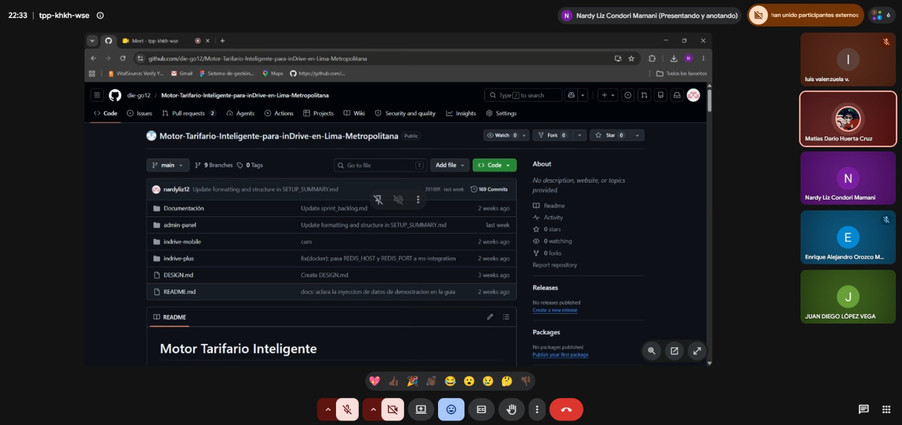

# Sprint 2 – Desarrollo del MVP

## 1. Información general

- **Proyecto:** Motor Tarifario Inteligente para inDrive en Lima Metropolitana
- **Sprint:** 2
- **Período:** lunes 1 → sábado 20 de junio de 2026 (cierre y retrospectiva: sábado 20)
- **Objetivo del sprint:** consolidar el MVP integrando backend, panel administrativo y aplicación móvil, con el cálculo tarifario, la visualización diferenciada por rol y el registro de los cálculos.

---

## 2. Continuidad con el Sprint 1

El Sprint 1 cerró con su presentación el **sábado 30 de mayo**. El Sprint 2 inició el **lunes 1 de junio**, de forma continua. Durante las primeras fases el avance fue principalmente **local** (cada integrante en su equipo) y se **consolidó en el repositorio de forma progresiva** hacia el cierre del sprint.

---

## 3. Sprint Goal

Entregar una versión funcional e integrada del sistema en la que un pasajero ve la tarifa máxima estimada, un conductor ve el ingreso mínimo garantizado, el administrador puede parametrizar y simular el motor, y cada cálculo queda registrado para auditoría.

---

## 4. Gestión del Product Backlog y priorización

### Product Backlog vs. Sprint Backlog

- **Product Backlog:** lista priorizada de todo lo que el producto necesita (las CAR / historias de usuario), ordenada por valor. Es vivo y se refina cada sprint.
- **Sprint Backlog:** subconjunto del Product Backlog que el equipo se compromete a entregar en este sprint, más el plan (tareas) para lograrlo.

### Criterio de priorización: MoSCoW

Se prioriza con **MoSCoW** (Must / Should / Could / Won't). Para asignar la categoría se consideran tres factores: **valor para el diferencial del producto**, **dependencia técnica** y **riesgo**.

| Ítem | MoSCoW | Justificación |
| --- | --- | --- |
| HU-07 Motor calcula el rango | Must | Habilitador; sin él no hay producto |
| HU-05 Pasajero ve el techo | Must | Diferencial (visualización asimétrica) |
| HU-06 Conductor ve el piso | Must | Diferencial; complementa HU-05 |
| HU-08 Admin configura/simula parámetros | Should | Mejora operativa; depende del motor |
| HU-09 Registro de cálculos (auditoría) | Should | Trazabilidad; no bloquea la demo del rango |
| Reportes y dashboard de anomalías | Could | Deseable si sobra tiempo |
| APIs reales (OSINERGMIN/tráfico), GPS, pagos, RabbitMQ, OpenSearch, MFA | Won't (este sprint) | Fuera de alcance consciente → trabajo futuro |

---

## 5. Historias de usuario del Sprint 2

> Cada historia incluye sus **criterios de aceptación** y **dónde se demuestra** en el sistema.

### HU-05 — Tarifa máxima para el pasajero
*Como pasajero, quiero ver el precio máximo estimado antes de iniciar el viaje, para saber cuánto pagaré como máximo.*

| Criterio de aceptación | Dónde se demuestra |
| --- | --- |
| Dado origen y destino válidos, cuando solicito la cotización, entonces veo un precio máximo en S/ | App (pantalla de solicitud) → `POST /trips/quote` (rol passenger) |
| El pasajero NO ve el mínimo ni el rango interno | Respuesta de `/trips/quote` solo trae `maximumPrice` |
| La cotización responde en menos de 5 s | Demo en vivo |

### HU-06 — Ingreso mínimo para el conductor
*Como conductor, quiero ver el ingreso mínimo garantizado, para decidir si acepto el viaje.*

| Criterio de aceptación | Dónde se demuestra |
| --- | --- |
| Dado un viaje disponible, cuando lo consulto como conductor, entonces veo el mínimo en S/ | App conductor → `GET /trips/available` / `POST /trips/quote` (rol driver) |
| El conductor NO ve el máximo | Respuesta solo trae `minimumPrice` |

### HU-07 — Cálculo del rango (habilitador técnico)
*El motor calcula el rango `[mínimo, máximo]` ponderando las 7 variables.*

| Criterio de aceptación | Dónde se demuestra |
| --- | --- |
| El rango respeta el tope ×2.0 y los límites S/3–150 | `POST /trips/quote` (admin ve min+max) |
| Los pesos son configurables | `/pricing/config` |

### HU-08 — Parametrización y simulación desde el panel
*Como administrador, quiero configurar los parámetros tarifarios y simular escenarios, para ajustar y entender el comportamiento del motor.*

| Criterio de aceptación | Dónde se demuestra |
| --- | --- |
| Dado que soy admin, cuando edito un parámetro y guardo, entonces se persiste y la siguiente cotización lo refleja | Panel → `GET/PUT /pricing/config` |
| Solo el rol admin accede (otros → 403) | Guard de rol |
| El admin ajusta oferta/demanda en el simulador y ve el rango cambiar | Panel → sección Simulador |

### HU-09 — Registro de cálculos (auditoría)
*Como administrador/auditor, quiero que cada cálculo de tarifa quede registrado, para auditar y analizar las decisiones de precio.*

| Criterio de aceptación | Dónde se demuestra |
| --- | --- |
| Dado un cálculo, cuando se genera, entonces se persiste un registro (entrada, rango, timestamp) | MongoDB `pricing_logs` / `pricing_history` |
| El registro es consultable/verificable | Inspección en Mongo |

---

## 6. Carryover desde el Sprint 1

Al cierre del Sprint 1, el panel administrativo y la aplicación móvil estaban en sus ramas (no integrados a `main`). En el Sprint 2 se realizó esa integración:

- Integración del **panel administrativo** a `main`.
- Integración de la **aplicación móvil** a `main`.
- Integración de la **contenerización (Docker)** a `main`.

---

## 7. Tareas del Sprint (por historia)

> Estado: ✅ Hecho · 🟡 En curso · ⚪ Pendiente. *(Se actualiza conforme avanza el sprint.)*

### HU-05 / HU-06 — Asimetría
| Tarea | Estado |
| --- | --- |
| Presentador asimétrico por rol (backend) | ✅ |
| Consumo en app del pasajero (techo) | ✅ |
| Consumo en app del conductor (piso) | ✅ |
| Pruebas por rol | 🟡 |

### HU-07 — Motor
| Tarea | Estado |
| --- | --- |
| Fórmula de 7 variables + topes/límites | ✅ |
| Precios de combustible por tipo (dataset OSINERGMIN local) | 🟡 |

### HU-08 — Panel / simulación
| Tarea | Estado |
| --- | --- |
| Editor de configuración (`/pricing/config`) | 🟡 |
| Simulador con controles de oferta/demanda | ⚪ |

### HU-09 — Auditoría
| Tarea | Estado |
| --- | --- |
| Persistencia de cálculos en Mongo por eventos | ✅ |

---

## 8. Fuentes de datos (real vs. simulado)

| Fuente | Modo | Detalle |
| --- | --- | --- |
| Google Maps | En vivo | distancia, ruta, búsqueda de destino |
| OSINERGMIN (combustible) | Dato real local | dataset oficial (Datos Abiertos/Facilito); no hay API pública en tiempo real |
| Tráfico | Simulado | modelo por hora/zona |
| Capacidad, hora/demanda, histórico | Interno | perfil del vehículo y base de datos |

---

## 9. Simulador de oferta/demanda (HU-08)

El panel administrativo incorpora un **simulador** con controles de **oferta** y **demanda**. Estos controles ajustan el **factor dinámico** que el motor ya usa (hora/demanda) y permiten visualizar en vivo cómo varía el rango, siempre respetando el tope ×2.0.

- Las 7 variables del motor **no cambian**: oferta/demanda son controles del simulador, no variables nuevas del motor.
- El **surge real en tiempo real** (basado en conductores online vs. viajes en búsqueda) queda como **trabajo futuro**.

---

## 10. Métricas Scrum

> Los valores se completan con los datos reales del equipo (no se estiman a la ligera).

### Velocity (puntos de historia por sprint)
| Sprint | Comprometidos (SP) | Completados (SP) |
| --- | --- | --- |
| Sprint 1 | `[ ]` | `[ ]` |
| Sprint 2 | `[ ]` | `[ ]` |

### Puntos por historia (Sprint 2)
| HU | Story Points | Estado |
| --- | --- | --- |
| HU-05 | `[ ]` | `[ ]` |
| HU-06 | `[ ]` | `[ ]` |
| HU-07 | `[ ]` | `[ ]` |
| HU-08 | `[ ]` | `[ ]` |
| HU-09 | `[ ]` | `[ ]` |

### Burndown (SP restantes por día del sprint)
| Día | SP restantes (ideal) | SP restantes (real) |
| --- | --- | --- |
| Día 1 | `[total]` | `[ ]` |
| … | … | … |
| Último día | 0 | `[ ]` |

### Historias pendientes / no entregadas
| HU / Ítem | Estado | Motivo | Destino |
| --- | --- | --- | --- |
| `[ ]` | `[ ]` | `[ ]` | Trabajo futuro |

---

## 11. Riesgos identificados

- Dependencia de APIs externas (mitigado con modo simulado/local + circuit breaker).
- Divergencia entre ramas de larga vida (mitigado sincronizando `main` y con PRs).
- Inconsistencias en el cálculo tarifario.
- Sincronización entre entornos de desarrollo.

---

## 12. Retrospectiva y lecciones aprendidas

> Se completa el **sábado 20 de junio**, tras la sesión de Retrospective. Ver también `retrospective.md`.

**Qué salió bien:** `[a completar el sábado]`

**Qué se puede mejorar:** `[a completar el sábado]`

**Acciones de mejora:** `[a completar el sábado]`

**Lecciones aprendidas:** `[a completar el sábado]`

---

## 13. Trabajo futuro / no entregado (no hay Sprint 3)

Por ser el último sprint del curso, lo no entregado se documenta como roadmap, no como carryover:

- Integración **en vivo** con API real de OSINERGMIN (hoy: dataset local).
- API de **tráfico real** (TomTom/Waze) — de pago.
- **Recálculo con GPS real** post-viaje (hoy: simulado).
- **Pagos reales**.
- **Surge pricing real** (oferta/demanda en tiempo real).
- Migración a **RabbitMQ**, **OpenSearch** para logs, **MFA** del administrador.

---

## 14. Definición de Terminado (Definition of Done)

- Código implementado y versionado en GitHub.
- Funcionalidades probadas en entorno local.
- Documentación actualizada.
- Revisión y aprobación del equipo (PR).

---

## 15. Evidencias

> Capturas y referencias de commits. *(Se completan conforme avanza el sprint.)*

- `[captura: cotización asimétrica pasajero/conductor]`
- `[captura: panel — configuración y simulador]`
- `[captura: registro en MongoDB]`

---

## 16. Cierre / Sprint Review final

Por ser el último sprint, el cierre consolida:

- **Objetivo de Producto:** `[logrado total/parcial + evidencia]`.
- **Entregado vs. pendiente:** ver secciones 7 y 13.
- **Trabajo futuro:** ver sección 13.
- **Lecciones aprendidas:** ver sección 12.

---

## Reunión de Sprint

> Evidencia fotográfica de la reunión del Sprint 2.

### Participantes

- Matias Dario
- Nardy Condori
- Juan Diego Lopez
- Enrique Orozco
- Luis Valenzela

### Acuerdos

- Revisar el avance del motor tarifario al cierre del sprint.
- Priorizar la integración entre la aplicación móvil y el backend.
- Registrar incidencias y bloqueos durante las reuniones diarias.
