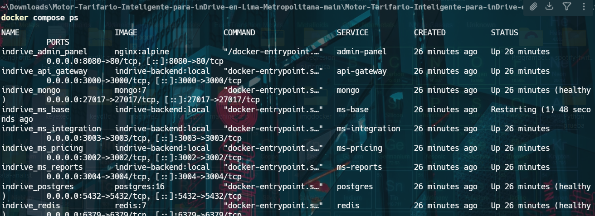
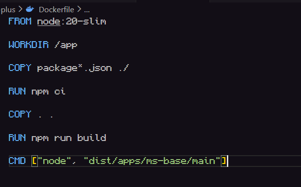
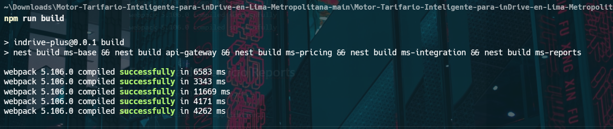
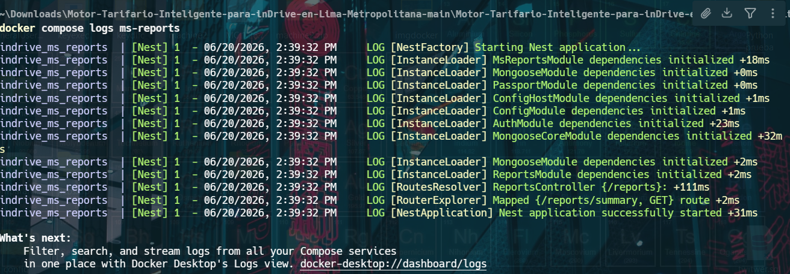
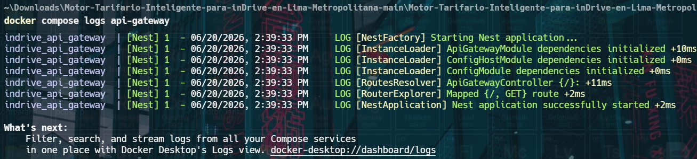

# Documentación de Despliegue y Resolución de Incidencias Docker

## Proyecto

Motor Tarifario Inteligente para inDrive+ - Sprint 2

## Objetivo

Levantar la arquitectura de microservicios mediante Docker Compose para validar la integración entre:

* API Gateway
* MS Base
* MS Pricing
* MS Integration
* MS Reports
* PostgreSQL
* MongoDB
* Redis
* Panel Administrativo

---

# Arquitectura Desplegada

```text
┌─────────────────┐
│   Admin Panel   │
└────────┬────────┘
         │
         ▼
┌─────────────────┐
│   API Gateway   │
└────────┬────────┘
         │
 ┌───────┼─────────┐
 │       │         │
 ▼       ▼         ▼
MS Base  Pricing  Reports
 │
 ▼
Integration

Servicios de soporte:
- PostgreSQL
- MongoDB
- Redis
```

---

# Problema Encontrado

Durante el despliegue inicial con Docker Compose el microservicio `ms-base` entraba en un ciclo continuo de reinicio.

Estado observado:

```bash
docker compose ps
```

```text
NAME                     STATUS
indrive_ms_base          Restarting
indrive_api_gateway      Up
indrive_ms_reports       Up
indrive_ms_pricing       Up
indrive_ms_integration   Up
indrive_postgres         Up (healthy)
indrive_mongo            Up (healthy)
indrive_redis            Up (healthy)
```

---

# Evidencia del Error

```bash
docker compose logs --tail=100 ms-base
```

```text
Error:
/app/node_modules/bcrypt/lib/binding/napi-v3/bcrypt_lib.node:
invalid ELF header

Node.js v20.20.2
```

---



# Análisis de la Causa

La imagen Docker estaba copiando directamente el directorio:

```dockerfile
COPY node_modules ./node_modules
```

Los módulos habían sido instalados previamente en Windows.

Docker ejecuta un entorno Linux.

Por lo tanto:

* node_modules fue compilado para Windows
* Docker intentó ejecutar binarios Linux
* bcrypt generó incompatibilidad binaria

Resultado:

```text
invalid ELF header
```

---

# Solución Aplicada

## Dockerfile Original

```dockerfile
FROM node:20-slim

WORKDIR /app

COPY package*.json ./
COPY node_modules ./node_modules
COPY dist ./dist

CMD ["node", "dist/apps/ms-base/main"]
```

## Dockerfile Corregido

```dockerfile
FROM node:20-slim

WORKDIR /app

COPY package*.json ./

RUN npm ci

COPY . .

RUN npm run build

CMD ["node", "dist/apps/ms-base/main"]
```

---



# Limpieza del Entorno

Se eliminaron contenedores, redes y volúmenes existentes:

```bash
docker compose down -v
```

Posteriormente se eliminó la imagen local:

```bash
docker image rm indrive-backend:local
```

Finalmente se reconstruyó completamente:

```bash
docker compose build --no-cache
```

---

# Segundo Problema Encontrado

Durante la reconstrucción apareció el error:

```text
Module not found:
Can't resolve 'bcrypt'
```

---

# Diagnóstico

Aunque el proyecto referenciaba:

```typescript
import * as bcrypt from 'bcrypt';
```

Docker no encontraba la dependencia durante la compilación.

---

# Solución

Se reinstalaron las dependencias y se regeneró el proceso de build.

Verificación:

```bash
npm run build
```

Resultado:

```text
webpack compiled successfully
```

para:

* ms-base
* api-gateway
* ms-pricing
* ms-integration
* ms-reports

---

# Evidencia de Compilación Exitosa

```text
webpack 5.106.0 compiled successfully
webpack 5.106.0 compiled successfully
webpack 5.106.0 compiled successfully
webpack 5.106.0 compiled successfully
webpack 5.106.0 compiled successfully
```

---

# Evidencia de Servicio Reports

```bash
docker compose logs ms-reports
```

```text
[Nest] Starting Nest application...

MsReportsModule dependencies initialized

ReportsController {/reports}

Mapped {/reports/summary, GET} route

Nest application successfully started
```

---



# Evidencia de API Gateway

```bash
docker compose logs api-gateway
```

```text
[Nest] Starting Nest application...

ApiGatewayModule dependencies initialized

Mapped {/, GET} route

Nest application successfully started
```

---



# Evidencia de Contenedores

```bash
docker compose ps
```

```text
indrive_admin_panel
indrive_api_gateway
indrive_mongo
indrive_ms_integration
indrive_ms_pricing
indrive_ms_reports
indrive_postgres
indrive_redis
```

---

# Buenas Prácticas Implementadas

## Docker

* Uso de Docker Compose
* Servicios desacoplados
* Redes internas privadas
* Persistencia mediante volúmenes
* Healthchecks

## Bases de Datos

* PostgreSQL para datos transaccionales
* MongoDB para reportes y auditoría
* Redis para caché y comunicación rápida

## Seguridad

* JWT Access Token
* JWT Refresh Token
* Variables de entorno
* Hash de contraseñas con bcrypt

---

# Lecciones Aprendidas

1. Nunca copiar `node_modules` del sistema anfitrión hacia Docker.
2. Siempre instalar dependencias dentro del contenedor.
3. Utilizar `.dockerignore` para excluir archivos innecesarios.
4. Validar la compilación local antes del despliegue.
5. Utilizar healthchecks para garantizar dependencias disponibles antes del arranque.

---

# Estado Final

| Componente     | Estado                |
| -------------- | --------------------- |
| PostgreSQL     | Operativo             |
| MongoDB        | Operativo             |
| Redis          | Operativo             |
| MS Base        | Compilación corregida |
| MS Pricing     | Operativo             |
| MS Integration | Operativo             |
| MS Reports     | Operativo             |
| API Gateway    | Operativo             |
| Admin Panel    | Operativo             |

## Resultado

La arquitectura de microservicios fue compilada exitosamente mediante Docker y quedó preparada para la validación funcional del Sprint 2.
